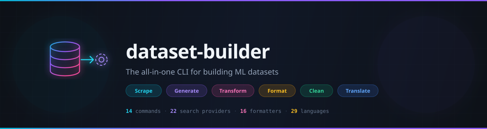
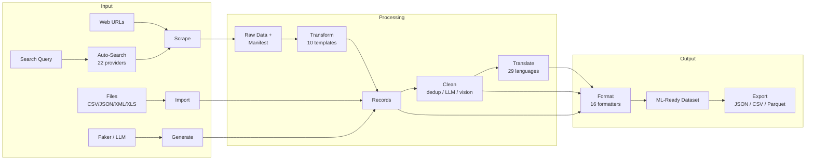

<p align="center">
  <a href="https://github.com/3koozy/dataset-builder">
    
  </a>
</p>

<p align="center">
  <a href="https://nodejs.org/"></a>
  <a href="https://www.typescriptlang.org/"></a>
  <a href="LICENSE"></a>
  <a href="https://github.com/3koozy/dataset-builder/actions/workflows/ci.yml"></a>
</p>

<p align="center">
  <b>Scrape, synthesize, clean, transform, and format datasets for ML/LLM training — one CLI, zero vendor lock-in.</b>
</p>

---

## Key Features

- **22 search providers** — Google, Bing, DuckDuckGo, arXiv, Reddit, Sketchfab, and more (most need no API key)
- **16 output formatters** — Alpaca, ChatML, ShareGPT, COCO, YOLO, LLaVA, Parquet, HuggingFace DatasetDict
- **10 transform templates** — text Q&A, image classification, object detection, segmentation, and more
- **Ollama-powered** — LLM generation, translation (29 languages), vision filtering, quality scoring
- **Multi-modal** — text, images, video, audio, and 3D assets in a single pipeline
- **Resume support** — interrupted downloads resume from manifest with no re-work
- **No vendor lock-in** — runs entirely on local Ollama models; no cloud API required

## Quick Start

```bash
# 1. Clone and install
git clone https://github.com/3koozy/dataset-builder.git
cd dataset-builder && npm install

# 2. Scrape images of sports cars (no API key needed)
npm start -- scrape --search "sports cars" --download --formats image

# 3. Format the result for ML training
npm start -- format -i output/task_* -f imagefolder -o dataset/
```

<!--  -->

## Commands

| Command      | Description                                                 |
| :----------- | :---------------------------------------------------------- |
| `scrape`     | Web scraping with auto-search across 22 providers           |
| `generate`   | Synthetic data via Faker or LLM (Ollama)                    |
| `web-search` | Standalone web search using Ollama's web search API         |
| `import`     | Import from CSV, JSON, JSONL, XML, XLS/XLSX, TXT, HTML      |
| `export`     | Export to JSON, JSONL, CSV                                  |
| `format`     | Format datasets for ML training (16 formatters)             |
| `transform`  | Transform scraped data to structured records (10 templates) |
| `clean`      | Deduplicate, LLM filter, vision filter, math verify         |
| `translate`  | LLM-powered translation to 29 languages                     |
| `config`     | Manage configuration (get/set/list/reset/ollama-sync)       |
| `compress`   | Media compression via ffmpeg                                |
| `prune`      | Clean output files by age or pattern                        |
| `resume`     | Resume interrupted downloads from task folder               |
| `run`        | Execute multi-step pipeline configs (JSON workflows)        |

## Supported Formats

<table>
<tr>
<td>

**Text / LLM**

- Alpaca
- ChatML
- ShareGPT
- OASST
- Raw

</td>
<td>

**Vision**

- LLaVA
- ImageFolder
- CSV-Images
- COCO
- YOLO
- COCO-Seg
- YOLO-Seg

</td>
<td>

**Audio**

- AudioFolder
- Speech-Text

**HuggingFace**

- DatasetDict
- Parquet

</td>
</tr>
</table>

## Search Providers

| Category | Providers                                                    |
| :------- | :----------------------------------------------------------- |
| Web      | Google, Bing, DuckDuckGo, Brave, Ollama + 5 SerpAPI variants |
| Images   | Google Images, Bing Images                                   |
| Video    | YouTube                                                      |
| Academic | arXiv, Google Scholar, Semantic Scholar                      |
| Code     | GitHub                                                       |
| 3D       | Sketchfab                                                    |
| Social   | Reddit, Twitter, Facebook, Instagram                         |

**Source presets:** `web` `images` `videos` `academic` `code` `3d-assets` `social`

## Workflow Examples

<details>
<summary><b>Build a text Q&A dataset</b></summary>

<br>

```bash
# Scrape articles about transformers from academic sources
npm start -- scrape --search "transformer architecture" --source-preset academic

# Transform scraped pages into Q&A pairs
npm start -- transform -i output/task_* -t text-qa --target "transformers" -o qa.json

# Format as Alpaca with train/val/test split
npm start -- format -i qa.json -f alpaca -o dataset/ --split 80:10:10
```

</details>

<details>
<summary><b>Create an image classification dataset</b></summary>

<br>

```bash
# Scrape and download images
npm start -- scrape --search "dog breeds" --download --formats image

# Clean: remove junk, filter by relevance
npm start -- clean -i output/task_*/downloads --remove-junk --vision-filter --vision-target "dogs"

# Classify with free-form labels
npm start -- transform -i output/task_* -t image-classification --target "dog breeds" -o classified.json

# Or constrain to specific breeds
npm start -- transform -i output/task_* -t image-classification --target "dog breeds" \
  --labels "labrador,poodle,bulldog,beagle" -o classified.json

# Or auto-discover breed categories from the images
npm start -- transform -i output/task_* -t image-classification --target "dog breeds" \
  --auto-labels -o classified.json

# Format for training (also accepts directory: format -i output/task_*)
npm start -- format -i classified.json -f imagefolder -o dataset/ --copy-media
```

</details>

<details>
<summary><b>Generate and translate synthetic data</b></summary>

<br>

```bash
# Generate Q&A pairs with Ollama
npm start -- generate -t llm -p "Write a customer support Q&A about returns" -c 50

# Translate to Spanish and Japanese
npm start -- translate -i output/llm_*.json -l es ja -y

# Format as ChatML
npm start -- format -i output/llm_*_es.json -f chatml -o dataset/
```

</details>

## Notebooks

Interactive Jupyter notebooks to learn the CLI step by step:

| Notebook                                                         | Description                                        |
| :--------------------------------------------------------------- | :------------------------------------------------- |
| [01-quickstart](notebooks/01-quickstart.ipynb)                   | Scrape → transform → format end-to-end walkthrough |
| [02-data-generation](notebooks/02-data-generation.ipynb)         | Faker types and LLM-powered synthetic data         |
| [03-import-clean-format](notebooks/03-import-clean-format.ipynb) | Import CSVs/JSONs, clean, and export in ML formats |
| [04-pipelines](notebooks/04-pipelines.ipynb)                     | Multi-step pipeline configs with JSON workflows    |
| [05-vision-datasets](notebooks/05-vision-datasets.ipynb)         | Image scraping, cleaning, and vision format export |

## AI Agent / Automation

The CLI is designed to work well from AI agents, automation scripts, and CI/CD pipelines:

```bash
# Structured JSON output — stdout is clean JSON, logs go to stderr
npm start -- scrape --search "cats" --json --yes

# Quiet mode — suppress progress, keep errors and final result
npm start -- format -i data.json -f alpaca -o dataset/ --quiet

# Dry-run — preview what would happen without executing
npm start -- clean -i data.json --dedupe --dry-run --json

# Stdin options — pipe complex configs as JSON
echo '{"search":"cats","download":true}' | npm start -- scrape --stdin --json

# Pipeline validation without execution
npm start -- run -c pipeline.json --validate
```

| Flag        | Purpose                                                  |
| :---------- | :------------------------------------------------------- |
| `--json`    | Machine-readable JSON output to stdout (implies `--yes`) |
| `--quiet`   | Suppress progress/status output                          |
| `--yes`     | Auto-accept all confirmation prompts                     |
| `--dry-run` | Preview operations without executing                     |
| `--stdin`   | Read options as JSON from stdin                          |

**Exit codes:** `0` success, `1` error, `2` invalid input, `3` missing dependency, `4` network error, `5` Ollama unavailable, `6` partial success, `7` user abort

**Env vars:** `DATASET_BUILDER_JSON=1`, `DATASET_BUILDER_QUIET=1`, `CI=true` (implies `--yes`)

See [docs/agent-friendly-cli.md](docs/agent-friendly-cli.md) for the full design document and [docs/agent-protocol.md](docs/agent-protocol.md) for the JSON protocol specification.

## Web Dashboard

A browser-based UI for all dataset-builder operations with real-time job monitoring, data browsing, and full i18n support.

```bash
# Start development servers (API + Vite hot-reload)
npm run dev:web

# Build for production
npm run build:web

# Start production server
npm run start:web

# Or via the CLI
npm start -- web
```

**Docker:**

```bash
docker build -t dataset-builder .
docker run -p 3000:3000 dataset-builder
```

**Keyboard shortcuts:** Press `Ctrl+K` (or `Cmd+K` on macOS) to open the command palette for quick page navigation.

## Architecture



## Configuration

Key settings managed via `npm start -- config set <key> <value>`:

| Key                       | Description                  | Default     |
| :------------------------ | :--------------------------- | :---------- |
| `outputDir`               | Default output directory     | `./output`  |
| `ollamaModel`             | Default Ollama model         | `llama3.2`  |
| `ollamaConcurrency`       | Parallel LLM text requests   | `4`         |
| `ollamaVisionConcurrency` | Parallel LLM vision requests | `2`         |
| `ollamaClassifyModel`     | Model for relevance scoring  | (default)   |
| `ollamaGenerateModel`     | Model for content generation | (default)   |
| `maxConcurrent`           | Concurrent downloads         | `5`         |
| `searchProvider`          | Default search provider      | auto-detect |

See `npm start -- config list` for all options, or `npm start -- config show` for concurrency/model details.

## Prerequisites

| Dependency       | Version | Required | Purpose                             |
| :--------------- | :------ | :------: | :---------------------------------- |
| Node.js          | 18+     |   Yes    | Runtime                             |
| npm              | bundled |   Yes    | Package manager                     |
| Git              | any     |   Yes    | Clone repository                    |
| Python           | 3.8+    |    No    | Scrapy web scraping                 |
| Ollama           | latest  |    No    | LLM generation, translation, vision |
| ffmpeg / ffprobe | latest  |    No    | Media compression, audio duration   |
| yt-dlp           | latest  |    No    | YouTube video/audio downloads       |

## Development

```bash
npm run dev             # Run in dev mode (ts-node)
npm run build           # Compile TypeScript
npm test                # Run tests (vitest)
npm run lint            # Lint with ESLint
npm run format          # Format with Prettier
```

## License

[MIT](LICENSE) &copy; 2026 [3koozy](https://github.com/3koozy)
