# dataset-builder - Technical Documentation

## Table of Contents

1. [Architecture Overview](#architecture-overview)
2. [Pipeline Overview](#pipeline-overview)
3. [Components](#components)
4. [API Reference](#api-reference)
5. [Configuration](#configuration)
6. [Data Models](#data-models)
7. [Usage Examples](#usage-examples)
8. [Transform Command Reference](#transform-command-reference)
9. [Downloads Manifest Reference](#downloads-manifest-reference)
10. [Pipeline Stage Documentation](#pipeline-stage-documentation)
11. [Formatter Reference Cards](#formatter-reference-cards)
12. [End-to-End Walkthroughs](#end-to-end-walkthroughs)
13. [Known Limitations and Troubleshooting](#known-limitations-and-troubleshooting)

---

## Architecture Overview

The dataset-builder is a CLI tool for building datasets through web scraping, synthetic data generation, file importing, and data cleaning. It follows a modular architecture with clear separation of concerns.

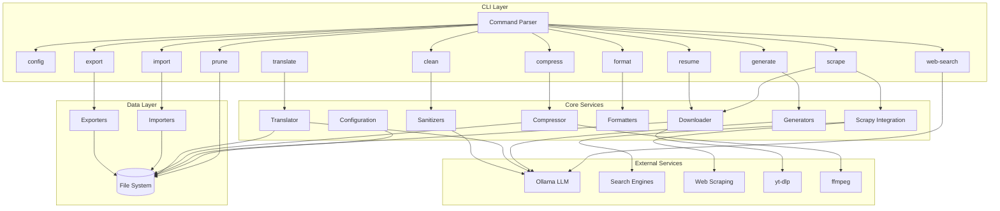

### Module Hierarchy

```
src/
├── cli/           # CLI entry point and commands
├── config/        # Configuration management
├── scrapy/        # Python Scrapy integration + auto-search
├── downloader/    # Multi-threaded file downloader + YouTube (yt-dlp)
├── compressor/    # Media compression (ffmpeg)
├── translator/    # LLM-powered dataset translation
├── formatters/    # Dataset formatters (text: Alpaca, ChatML, ShareGPT, OASST, Raw; vision: LLaVA, ImageFolder, CSV-Images, COCO, YOLO)
├── generators/    # Data generation (Faker + Ollama)
├── importers/     # File importers (CSV, JSON, XML, etc.)
├── exporters/     # Export formatters
├── sanitizers/    # Data cleaning utilities
├── utils/         # Shared utilities (logger, download summary)
└── pipeline/      # Pipeline runner
```

---

## Pipeline Overview

The dataset-builder follows a three-phase pipeline for transforming raw scraped data into ML-ready datasets:

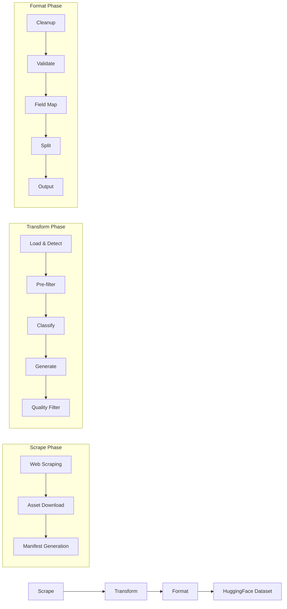

### Phase 1: Scrape

The scrape phase collects data from the web:

1. **Web Scraping** - Search engines or direct URL scraping with Python Scrapy
2. **Asset Download** - Multi-threaded downloads of images, videos, PDFs, documents
3. **Manifest Generation** - Automatic creation of `downloads_manifest.json` with metadata for every asset

**Output:** Task folder with `scraped.json`, `downloads/` directory, and asset manifest

### Phase 2: Transform

The transform phase converts raw scraped data into structured training records:

1. **Load & Detect** - Auto-detect input format (manifest, scraped JSON, task folder)
2. **Pre-filter** - Remove short/empty content, invalid files
3. **Classify** - LLM-powered relevance scoring against target topic
4. **Generate** - Create instruction/output pairs, Q&A, conversations, or captions
5. **Quality Filter** - Apply relevance threshold, deduplication

**Output:** `prepared.json` with formatter-ready records

### Phase 3: Format

The format phase converts structured records into standard ML training formats:

1. **Cleanup** - Deduplicate, validate, quality filter
2. **Validate** - Check required fields for chosen formatter
3. **Field Mapping** - Transform source fields to target structure
4. **Split** - Train/validation/test splitting (with optional stratification)
5. **Output** - Generate final dataset files (JSON, JSONL, Parquet)

**Output:** Formatted dataset ready for HuggingFace `load_dataset()`

---

## Components

### 1. Configuration System (`src/config/`)

The configuration system provides centralized configuration management with defaults, type safety, and CLI management.

**Files:**

- `defaults.ts` - Configuration interface and default values
- `loader.ts` - Configuration file I/O operations
- `index.ts` - Main configuration API

**Features:**

- Type-safe configuration with TypeScript
- Persistent storage using the `conf` library
- CLI commands for get/set/list/reset operations
- Automatic type parsing (number, boolean, string)

### 2. CLI Commands (`src/cli/commands/`)

The CLI is built on Commander.js with modular command structure.

| Command      | File           | Description                                              |
| ------------ | -------------- | -------------------------------------------------------- |
| `config`     | `config.ts`    | Manage application configuration (get, set, list, reset) |
| `prune`      | `prune.ts`     | Clean output files by age/pattern with dry-run support   |
| `scrape`     | `scrape.ts`    | Web scraping with auto-search and multi-format downloads |
| `generate`   | `generate.ts`  | Synthetic data via Faker or LLM/Ollama generation        |
| `clean`      | `clean.ts`     | Data sanitization with multiple filter options           |
| `import`     | `import.ts`    | Import from CSV, JSON, XML, XLS, TXT, HTML               |
| `export`     | `export.ts`    | Export to JSON, JSONL, CSV formats                       |
| `format`     | `format.ts`    | Format datasets for ML/LLM training formats              |
| `run`        | `run.ts`       | Execute full pipeline                                    |
| `resume`     | `resume.ts`    | Resume downloads from existing task folder               |
| `web-search` | `webSearch.ts` | Standalone web search using Ollama API                   |
| `compress`   | `compress.ts`  | Compress video/image files using ffmpeg                  |
| `translate`  | `translate.ts` | Translate datasets into multiple languages via LLM       |

### 3. Scrapy Integration (`src/scrapy/`)

Integration with Python Scrapy for web scraping capabilities.

**Files:**

- `runner.ts` - Execute Scrapy spiders with proper argument handling
- `autoSearch.ts` - Search engine integration (Google, Bing, DuckDuckGo)

**Features:**

- API-based search (Brave, Bing, Google Custom Search) when API keys are configured
- HTML scraping fallback for DuckDuckGo and when APIs unavailable
- HTML parsing with Cheerio
- URL extraction from web pages
- Configurable search result limits
- Enhanced anti-bot detection including RTL text detection

### 4. Downloader (`src/downloader/`)

Multi-threaded file downloader with TUI progress display, asset manifest tracking, and YouTube integration.

**Files:**

- `index.ts` - Main Downloader class with concurrency control, periodic TUI refresh, and manifest accumulation
- `types.ts` - AssetManifest and AssetRecord interfaces for per-file metadata tracking
- `manifest-utils.ts` - Tag extraction, manifest merging, and asset record building utilities
- `manifest.test.ts` - Unit tests for manifest functionality
- `fileHandler.ts` - File type handlers for images, videos, documents; routes YouTube URLs to yt-dlp
- `videoHandler.ts` - YouTube video/playlist download via yt-dlp, playlist info fetching
- `tui.ts` - Terminal UI progress bars with live refresh

**Features:**

- Configurable concurrent downloads
- Live TUI progress with 200ms periodic refresh (prevents freeze during long downloads)
- Retry logic with exponential backoff and User-Agent rotation
- File type detection and handling
- Support for images, videos, PDFs, PPTX, DOCX, CSV
- YouTube video and playlist downloads via yt-dlp
- Pre-download summary with confirmation prompt
- Configurable YouTube options: quality, audio-only, video-only
- Playlist video count detection before downloading
- **Asset Manifest**: Auto-generates `downloads_manifest.json` with per-file metadata

#### Asset Manifest System

The downloader automatically creates a manifest file (`downloads/downloads_manifest.json`) that tracks metadata for every downloaded asset.

**Purpose:**

- Track source URLs and local file paths for traceability
- Store page context (title, alt text, surrounding text) from scraped pages
- Enable asset-to-page linking for transform pipelines
- Support resume operations with manifest merging
- Provide auto-extracted tags for filtering and classification

**Manifest Schema:**

```typescript
interface AssetManifest {
  taskId: string; // Task identifier
  searchQuery: string | null; // Original search query
  generatedAt: string; // ISO timestamp
  totalAssets: number; // Total asset count
  version: string; // Manifest format version
  assets: AssetRecord[]; // Per-file records
}

interface AssetRecord {
  id: string; // "asset_0", "asset_1", etc.
  sourceUrl: string; // Direct download URL
  sourcePageUrl: string; // Page where link was found
  sourcePageTitle: string; // Title of source page
  localPath: string; // Relative path: "downloads/images/car.jpg"
  fileName: string; // File name
  fileType: string; // "image" | "video" | "pdf" | etc.
  fileSize: number; // Bytes
  status: string; // "completed" | "failed" | "skipped"
  downloadedAt: string; // ISO timestamp
  duration: number; // Download duration in ms
  context: {
    altText: string | null; // Image alt text
    surroundingText: string | null; // Text around link
    pageDepth: number; // Crawl depth
    tags: string[]; // Auto-extracted keywords
  };
  relevance: {
    score: number | null; // Populated by transform command
    matchesTarget: boolean | null;
    reason: string | null;
  };
}
```

**Tag Extraction:**

Tags are automatically extracted from:

- URL path segments: `/photos/cars/sports/` → `["photos", "cars", "sports"]`
- Page title words: "Sports Cars Gallery" → `["sports", "cars", "gallery"]`
- Domain name: `github.com` → `["github"]`

Stop words ("the", "and", "in", etc.) are filtered out. Tags are sorted alphabetically.

**Manifest Lifecycle:**

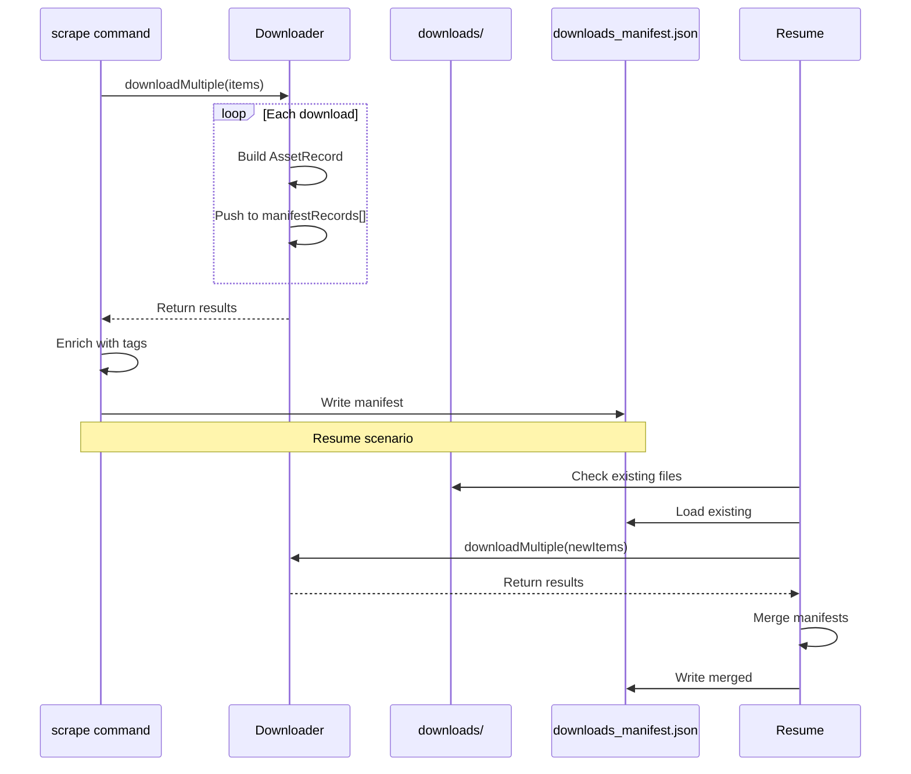

**Usage:**

```bash
# Manifest is auto-created during scrape
npm start -- scrape --search "cars" --download --formats image

# View manifest
cat output/task_xxx/downloads/downloads_manifest.json | jq

# Extract completed assets with tags
jq '.assets[] | select(.status == "completed") | {file: .fileName, tags: .context.tags}' output/task_xxx/downloads/downloads_manifest.json

# Resume merges manifests automatically
npm start -- resume output/task_xxx
```

**Implementation Details:**

- Manifest is written to `downloads/downloads_manifest.json` (inside downloads subdirectory)
- Records are built during download completion (success or failure)
- On resume, existing manifest is loaded and merged with new downloads
- Re-downloaded files update existing records (sourceUrl is the merge key)
- Page context is captured from scraped page data during download item creation

### 5. Compressor (`src/compressor/`)

Media compression module using ffmpeg for post-download optimization.

**Files:**

- `index.ts` - Compression functions, ffmpeg availability check, media file discovery

**Features:**

- Video compression with configurable codec (h264, h265, av1) and CRF quality
- Image compression with configurable quality (1-100)
- Recursive media file discovery in directories
- Progress tracking via ffmpeg's `time=` output
- Replace originals by default, or keep with `--keep-original`
- Dry-run mode for previewing files
- Requires system-installed ffmpeg (not bundled)

**Supported Video Formats:** mp4, webm, mkv, avi, mov, flv, wmv, m4v, mpg, mpeg, 3gp, ogv, ts

**Supported Image Formats:** jpg, jpeg, png, bmp, tiff, tif, webp

### 6. Translator (`src/translator/`)

LLM-powered dataset translation for building multilingual training datasets.

**Files:**

- `languages.ts` - Language registry (29 languages) and model-language mapping
- `engine.ts` - Translation engine with batch processing and structured output
- `tui.ts` - Terminal UI for translation progress display
- `index.ts` - Barrel re-export

**Features:**

- Translate datasets into 29+ languages via Ollama LLM
- Batch processing with dynamic batch sizing (auto-reduces for large payloads)
- Ollama structured output (`format` parameter) for reliable JSON responses
- Deterministic JSON repair fallback (markdown stripping, bracket balancing)
- Record-by-record fallback when batch translation fails
- Field-level control: translate only specific fields or exclude fields
- Per-language or merged output modes
- Progress TUI with alternate screen, ETA, per-language stats
- Graceful SIGINT handling with partial result saving
- Configurable model, batch size, temperature, and retry count

**Supported Languages:** English, Spanish, French, German, Italian, Portuguese, Chinese, Japanese, Korean, Arabic, Hindi, Russian, Dutch, Polish, Turkish, Vietnamese, Thai, Swedish, Danish, Finnish, Norwegian, Ukrainian, Czech, Romanian, Greek, Hebrew, Indonesian, Malay, Bengali

### 7. Generators (`src/generators/`)

Data generation through Faker.js and LLM integration.

**Files:**

- `faker.ts` - Synthetic data generation using @faker-js/faker
- `ollama.ts` - Ollama API client with streaming support
- `structured.ts` - Structured JSON output with schema validation

**Faker Data Types:**

- `person` - Names, contact info, demographics
- `address` - Street, city, country, postal codes
- `company` - Company names, catch phrases
- `product` - Product names, descriptions, prices
- `text`/`lorem` - Generated text content
- `all` - Mixed data types

**LLM Features:**

- Text generation with Ollama
- Structured JSON output with schema validation
- Streaming responses
- Retry logic with exponential backoff
- Model management (list, ping)

### 8. Importers (`src/importers/`)

Multi-format file importing with automatic type detection.

**Supported Formats:**

- **CSV** - Delimited text with header parsing
- **JSON** - Array or object parsing
- **JSONL** - Newline-delimited JSON
- **XML** - XML parsing with automatic extraction
- **XLS/XLSX** - Excel workbook reading
- **TXT** - Line-based text parsing
- **HTML** - Link, image, heading, paragraph extraction

### 9. Exporters (`src/exporters/`)

Multi-format data export with flattening options.

**Supported Formats:**

- **JSON** - Pretty-printed or compact JSON
- **JSONL** - Newline-delimited JSON
- **CSV** - Comma-separated values with proper escaping

**Features:**

- Automatic field extraction for CSV
- Object flattening for nested data
- Proper CSV escaping for special characters

### 10. Sanitizers (`src/sanitizers/`)

Data cleaning and validation utilities.

**Files:**

- `index.ts` - Basic cleaning operations (dedupe, trim, normalize)
- `llmFilter.ts` - LLM-based text filtering (profanity, relevance)
- `mathVerifier.ts` - Mathematical expression verification using mathjs
- `factCheck.ts` - Factual claim verification
- `visionFilter.ts` - Vision-based image filtering

**Basic Cleaning Options:**

- `dedupe` - Remove duplicate records
- `trim` - Trim whitespace from strings
- `lowercase` - Convert strings to lowercase
- `removeEmpty` - Remove empty fields
- `normalizeNewlines` - Normalize line endings

**LLM Filter Options:**

- `strictness` - low/medium/high filtering thresholds
- `target` - Target topic for relevance filtering
- `batchSize` - Batch processing size

**Math Verification:**

- Expression extraction from text
- Evaluation using mathjs
- Support for complex expressions
- Validation of equality claims

### 11. Formatters (`src/formatters/`)

Dataset formatting system for converting raw data into standard ML/LLM training formats. Uses a plugin-based architecture with a formatter registry.

**Files:**

- `types.ts` - Core interfaces (`Formatter`, `FormatOptions`, `ChatMLOptions`, `AlpacaOptions`, `ShareGPTOptions`, `OASSTOptions`, `LLaVAOptions`, `ImageFolderOptions`, `CsvImagesOptions`, `COCOOptions`, `YOLOOptions`, `AudioFolderOptions`, `SpeechTextOptions`, `DatasetDictOptions`)
- `registry.ts` - Formatter registry (register/get/list formatters)
- `index.ts` - Main orchestrator: load → cleanup → validate → map → split → format → output
- `utils.ts` - Shared utilities (field mapping, splitting, token estimation, file I/O)
- `text/alpaca.ts` - Stanford Alpaca format (instruction/input/output)
- `text/chatml.ts` - OpenAI ChatML format (messages with role/content)
- `text/sharegpt.ts` - ShareGPT conversation format (human/gpt/system turns)
- `text/oasst.ts` - OpenAssistant message tree format (parent-child threading)
- `text/raw.ts` - Simple prompt/completion pairs
- `text/index.ts` - Barrel exports for text formatters
- `vision/llava.ts` - LLaVA vision-language format (image + conversations)
- `vision/imagefolder.ts` - Image classification folder structure (class_name/image.jpg)
- `vision/csv-images.ts` - CSV metadata with image paths + JSON/JSONL output
- `vision/coco.ts` - COCO object detection format (annotations.json)
- `vision/yolo.ts` - YOLO detection format (images/ + labels/ + classes.txt)
- `vision/utils.ts` - Vision utilities (image validation, copying, base64, bbox conversion)
- `vision/index.ts` - Barrel exports for vision formatters
- `audio/audiofolder.ts` - Audio classification folder structure (class_name/audio.wav)
- `audio/speech-text.ts` - Speech transcription format (audio + text pairs)
- `audio/utils.ts` - Audio utilities (validation, ffprobe metadata, copying)
- `audio/index.ts` - Barrel exports for audio formatters
- `cleanup/` - Data cleanup pipeline (dedupe, validate, quality scoring)
- `huggingface/card.ts` - Dataset card generator (README.md with YAML frontmatter)
- `huggingface/datasetdict.ts` - HuggingFace DatasetDict format (JSON or Parquet)
- `huggingface/parquet.ts` - Standalone Apache Parquet format
- `huggingface/utils.ts` - HF utilities (schema inference, feature mapping, stratified split, Parquet row building)
- `huggingface/index.ts` - Barrel exports for HuggingFace formatters

**Architecture:**

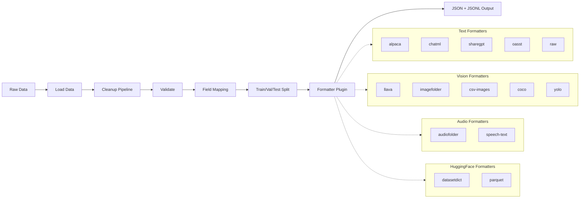

**Text Formatter Features:**

| Feature               | Alpaca                              | ChatML                                           | ShareGPT                        | OASST                             | Raw |
| --------------------- | ----------------------------------- | ------------------------------------------------ | ------------------------------- | --------------------------------- | --- |
| Conversation grouping | -                                   | `conversationIdField`                            | `conversationField`             | `treeIdField`                     | -   |
| System prompts        | -                                   | `systemPrompt`, `record.system`, `includeSystem` | `systemPrompt`, `record.system` | `systemPrompt` (as prompter root) | -   |
| Role mapping          | -                                   | `roleMap` (user/assistant/system)                | `humanField`, `assistantField`  | `parentIdField`                   | -   |
| Token statistics      | Yes                                 | Yes                                              | Yes                             | Yes                               | Yes |
| Pre-formatted input   | -                                   | `messages` array/JSON                            | `conversations` array/JSON      | `messages` array                  | -   |
| Empty field control   | `includeEmptyInput`, `defaultInput` | -                                                | -                               | -                                 | -   |
| Language tag          | -                                   | -                                                | -                               | `lang`                            | -   |

**Vision Formatter Features:**

| Feature          | LLaVA                    | ImageFolder        | CSV-Images       | COCO                              | YOLO                               |
| ---------------- | ------------------------ | ------------------ | ---------------- | --------------------------------- | ---------------------------------- |
| Image handling   | Path or base64 embedding | Copy to class dirs | Copy to images/  | Referenced in annotations.json    | Copy to images/                    |
| Bounding boxes   | -                        | -                  | -                | COCO format [x, y, w, h]          | Normalized [cx, cy, w, h]          |
| Category mapping | -                        | `classField`       | -                | `categoryNameField`, auto-mapping | `classField`, auto-indexing        |
| Output files     | JSON/JSONL               | Folder + metadata  | CSV + JSON/JSONL | annotations.json                  | labels/\*.txt + classes.txt + YAML |
| Media copying    | `copyMedia`              | Always copies      | `copyMedia`      | `copyMedia`                       | `copyMedia`                        |
| Bbox conversion  | -                        | -                  | -                | -                                 | Auto COCO-to-YOLO conversion       |

**Audio Formatter Features:**

| Feature        | AudioFolder        | SpeechText                |
| -------------- | ------------------ | ------------------------- |
| Audio handling | Copy to class dirs | Validate + optional copy  |
| Duration       | -                  | ffprobe or existing field |
| Output files   | Folder + metadata  | JSON + JSONL + CSV        |
| Media copying  | Always copies      | `copyMedia`               |
| Classification | `classField`       | -                         |
| Transcription  | -                  | `textField`               |

**HuggingFace Formatter Features:**

| Feature           | DatasetDict                     | Parquet                         |
| ----------------- | ------------------------------- | ------------------------------- |
| Output format     | JSON (default) or Parquet       | Parquet only                    |
| Schema inference  | Auto from data (evenly sampled) | Auto from data (evenly sampled) |
| Stratified split  | `stratifiedField`               | `stratifiedField`               |
| Dataset card      | `generateCard`                  | `generateCard`                  |
| dataset_info.json | Yes                             | Yes                             |
| metadata.json     | Yes (via orchestrator)          | Yes (via orchestrator)          |
| Field statistics  | In card body                    | In card body                    |
| Own splitting     | `handlesOwnSplitting = true`    | `handlesOwnSplitting = true`    |

**Formatter-Specific CLI Options:**

_Text formatters:_

| Option                    | Formatter | Description                                     |
| ------------------------- | --------- | ----------------------------------------------- |
| `--conversation-id-field` | ChatML    | Group records into multi-turn conversations     |
| `--role-map`              | ChatML    | JSON mapping of custom field names to roles     |
| `--include-system`        | ChatML    | Include/exclude system messages (default: true) |
| `--conversation-field`    | ShareGPT  | Group records into conversations by field       |
| `--human-field`           | ShareGPT  | Custom field name for human messages            |
| `--assistant-field`       | ShareGPT  | Custom field name for assistant messages        |
| `--tree-id-field`         | OASST     | Custom field for message tree ID                |
| `--parent-id-field`       | OASST     | Custom field for parent message ID              |
| `--lang`                  | OASST     | Language code for all messages                  |
| `--include-empty-input`   | Alpaca    | Include empty input field (default: true)       |
| `--default-input`         | Alpaca    | Default value for empty input fields            |
| `--system-prompt`         | All chat  | System prompt text for chat formats             |

_Vision formatters:_

| Option                  | Formatter        | Description                                     |
| ----------------------- | ---------------- | ----------------------------------------------- |
| `--image-field`         | All vision       | Field containing image paths (default: "image") |
| `--image-token`         | LLaVA            | Image placeholder token (default: "\<image\>")  |
| `--embed-images`        | LLaVA            | Embed images as base64 in output                |
| `--max-embed-size`      | LLaVA            | Maximum image size for base64 embedding (bytes) |
| `--class-field`         | ImageFolder/YOLO | Field containing class/category label           |
| `--image-extensions`    | ImageFolder      | Comma-separated allowed image extensions        |
| `--bbox-field`          | COCO/YOLO        | Field containing bounding boxes                 |
| `--category-id-field`   | COCO             | Field containing category ID                    |
| `--category-name-field` | COCO             | Field containing category name                  |
| `--image-width`         | YOLO             | Image width for bbox normalization              |
| `--image-height`        | YOLO             | Image height for bbox normalization             |
| `--copy-media`          | All vision       | Copy media files to output directory            |

_Audio formatters:_

| Option               | Formatter              | Description                                     |
| -------------------- | ---------------------- | ----------------------------------------------- |
| `--audio-field`      | All audio              | Field containing audio paths (default: "audio") |
| `--class-field`      | AudioFolder            | Field containing class/category label           |
| `--audio-extensions` | AudioFolder/SpeechText | Comma-separated allowed audio extensions        |
| `--text-field`       | SpeechText             | Field containing transcription text             |
| `--duration-field`   | SpeechText             | Field containing pre-existing duration value    |
| `--extract-duration` | SpeechText             | Use ffprobe to extract audio duration           |
| `--copy-media`       | All audio              | Copy audio files to output directory            |

_HuggingFace formatters:_

| Option               | Formatter           | Description                                             |
| -------------------- | ------------------- | ------------------------------------------------------- |
| `--output-format`    | DatasetDict         | Output format: `json` (default) or `parquet`            |
| `--features`         | DatasetDict/Parquet | HF features schema as JSON (auto-inferred if omitted)   |
| `--stratified-field` | DatasetDict/Parquet | Field for stratified splitting (class distribution)     |
| `--generate-card`    | All                 | Generate dataset card (README.md with YAML frontmatter) |
| `--license`          | All (card)          | License identifier (e.g., `mit`, `apache-2.0`)          |
| `--task-categories`  | All (card)          | Comma-separated task categories                         |
| `--card-language`    | All (card)          | Comma-separated language codes (e.g., `en,es`)          |
| `--card-description` | All (card)          | Description text for dataset card                       |

_Common options:_

| Option                 | Formatter | Description                              |
| ---------------------- | --------- | ---------------------------------------- |
| `--field-map`          | All       | JSON field mapping                       |
| `--split`              | All       | Train/val/test split ratios              |
| `--help-format <name>` | All       | Show detailed help for a specific format |

---

## API Reference

### Configuration API

```typescript
// Get configuration instance
import { getConfig } from './config';
const config = getConfig();

// Get value
config.get('outputDir');

// Set value
config.set('maxConcurrent', 10);

// Get all config
config.getAll();

// Reset to default
config.reset('outputDir');
config.reset(); // Reset all
```

### Ollama Client API

```typescript
import { getOllama } from './generators/ollama';
const ollama = getOllama();

// Check if running
const isOnline = await ollama.ping();

// List models
const models = await ollama.listModels();

// Generate text
const response = await ollama.generate({
  prompt: 'Write a haiku about coding',
  model: 'llama2',
  temperature: 0.7,
});

// Streaming generation
for await (const chunk of ollama.generateStream({
  prompt: 'Tell me a story',
})) {
  process.stdout.write(chunk);
}
```

### Structured Generation API

```typescript
import {
  generateStructured,
  generateStructuredBatch,
  GenerationMetrics,
  StructuredResult,
} from './generators/structured';

// Single structured generation
const result: StructuredResult = await generateStructured({
  prompt: 'Generate a user profile',
  schema: {
    type: 'object',
    properties: {
      name: { type: 'string' },
      age: { type: 'number' },
      email: { type: 'string' },
    },
    required: ['name', 'age'],
  },
  model: 'llama2',
});

// Result now includes timing and repair info
console.log(result.duration); // Response time in ms
console.log(result.repairAttempted); // Whether JSON repair was attempted
console.log(result.repairSuccess); // Whether repair succeeded

// Batch generation with metrics and progress callback
const { results, metrics }: { results: StructuredResult[]; metrics: GenerationMetrics } =
  await generateStructuredBatch(
    {
      prompt: 'Generate a product',
      schema: productSchema,
    },
    10,
    (progress) => {
      // Optional: Real-time progress updates
      console.log(`Progress: ${progress.current}/${progress.total} (${progress.status})`);
    }
  );

// Access comprehensive metrics
console.log(metrics.targetCount); // Total requested
console.log(metrics.successCount); // Successfully generated
console.log(metrics.failedCount); // Failed attempts
console.log(metrics.totalDuration); // Total time in ms
console.log(metrics.averageResponseTime); // Average per request
console.log(metrics.errorsByType); // Error breakdown by category
console.log(metrics.repairAttempts); // JSON repair attempts
console.log(metrics.repairSuccesses); // JSON repair successes
```

### Search API

```typescript
import { search, extractUrls, SearchResult, SearchProvider } from './scrapy/autoSearch';

// Search for URLs (auto-detects API vs HTML scraping based on config)
const results: SearchResult[] = await search(
  'AI research papers',
  10, // limit
  'duckduckgo' // provider: 'google' | 'bing' | 'duckduckgo' | 'brave'
);

// Extract URLs from a page
const urls: string[] = await extractUrls('https://example.com');
```

**API Key Configuration:**

```bash
# Set API keys for reliable search results
dataset-builder config set braveApiKey YOUR_BRAVE_KEY
dataset-builder config set bingApiKey YOUR_BING_KEY
dataset-builder config set googleApiKey YOUR_GOOGLE_KEY
dataset-builder config set googleSearchEngineId YOUR_ENGINE_ID

# Or use environment variables
BRAVE_API_KEY=xxx npm start -- scrape --search "query"

# Or pass via command line
npm start -- scrape --search "query" --search-provider brave --search-api-key YOUR_KEY
```

**Provider Priority:**

- **Brave**: API-first (most reliable), falls back to DuckDuckGo HTML scraping
- **Bing**: API-first, falls back to HTML scraping
- **Google**: API-first (requires Custom Search setup), falls back to HTML scraping
- **DuckDuckGo**: HTML scraping only (no official API)

### Downloader API

```typescript
import { Downloader, downloadMultiple, DownloadItem } from './downloader';

// Using Downloader class
const downloader = new Downloader({
  concurrent: 5,
  outputDir: './downloads',
  retry: 3,
  timeout: 30000,
});

downloader.add([
  { url: 'https://example.com/file.pdf', type: 'pdf', index: 0 },
  { url: 'https://example.com/image.jpg', type: 'image', index: 1 },
]);

const { completed, failed } = await downloader.start();

// Cancel immediately (aborts all in-flight fetch/yt-dlp)
downloader.cancel();

// Quick download multiple
const items: DownloadItem[] = [{ url: '...', type: 'image', index: 0 }];
const result = await downloadMultiple(items, { concurrent: 5 });

// With YouTube options
const result2 = await downloadMultiple(items, {
  concurrent: 5,
  youtubeOptions: {
    quality: '720',
    audioOnly: false,
    videoOnly: false,
  },
});
```

#### Abort / Cancellation

The downloader uses a shared `AbortController` to immediately abort all in-flight operations:

- **First Ctrl+C**: Calls `cancel()` → `abortController.abort()` → kills yt-dlp processes, aborts fetch calls, clears queue
- **Second Ctrl+C**: Force exits with `process.exit(1)` and a `.unref()` safety timeout for Windows cleanup
- The abort signal is plumbed through: `Downloader.processItem()` → `handleFileDownload()` → `downloadWithProgress()` (via `AbortSignal.any`) and `downloadYouTubeVideo/Playlist()` (via `signal.abort` listener)

### Download Summary API

```typescript
import { showDownloadSummary } from './utils/downloadSummary';

// With size estimation (default)
const confirmed = await showDownloadSummary(items, items.length, false, {
  cookiesFile: '.temp/www.youtube.com_cookies.txt',
});

// Skip size estimation (faster, count-only)
const confirmed2 = await showDownloadSummary(items, items.length, false, {
  skipEstimate: true,
});
```

### Compressor API

```typescript
import { checkFfmpeg, findMediaFiles, compressVideo, compressImage } from './compressor';

// Check ffmpeg availability
if (!checkFfmpeg()) {
  console.error('ffmpeg not installed');
}

// Find media files recursively
const { videos, images } = await findMediaFiles('./output/task_xxx');

// Compress a video
const result = await compressVideo(
  './video.mp4',
  {
    codec: 'h264',
    quality: 23,
    keepOriginal: false,
  },
  (percent) => console.log(`${percent}%`)
);

// Compress an image
const imgResult = await compressImage('./image.jpg', {
  imageQuality: 85,
  keepOriginal: true,
});
```

### Formatter API

```typescript
import { formatDataset } from './formatters';
import type { ExtendedFormatOptions } from './formatters';

// Format a dataset to Alpaca format
const result = await formatDataset({
  inputPath: './data.json',
  outputDir: './output/formatted',
  formatter: 'alpaca',
  fieldMap: {},
  splitRatios: [0.8, 0.1, 0.1],
  seed: 42,
});

// Format to ChatML with conversation grouping and role mapping
const chatmlResult = await formatDataset({
  inputPath: './conversations.json',
  outputDir: './output/chatml',
  formatter: 'chatml',
  fieldMap: {},
  conversationIdField: 'thread_id',
  roleMap: { user: 'question', assistant: 'answer' },
  systemPrompt: 'You are a helpful assistant',
  includeSystem: true,
});

// Format to ShareGPT with conversation threading
const sharegptResult = await formatDataset({
  inputPath: './qa-pairs.json',
  outputDir: './output/sharegpt',
  formatter: 'sharegpt',
  fieldMap: {},
  conversationField: 'session_id',
  humanField: 'query',
  assistantField: 'response',
});

// Format to OASST with language and tree structure
const oasstResult = await formatDataset({
  inputPath: './threads.json',
  outputDir: './output/oasst',
  formatter: 'oasst',
  fieldMap: {},
  treeIdField: 'thread_id',
  parentIdField: 'reply_to',
  lang: 'en',
  systemPrompt: 'You are helpful',
});

// Format to Alpaca without empty input fields
const alpacaResult = await formatDataset({
  inputPath: './instructions.json',
  outputDir: './output/alpaca',
  formatter: 'alpaca',
  fieldMap: {},
  includeEmptyInput: false,
  defaultInput: 'N/A',
});

// Format to HuggingFace DatasetDict with Parquet output
const hfResult = await formatDataset({
  inputPath: './data.json',
  outputDir: './output/hf',
  formatter: 'datasetdict',
  fieldMap: {},
  splitRatios: [0.8, 0.1, 0.1],
  outputFormat: 'parquet',
  generateCard: true,
  cardLicense: 'mit',
  cardLanguage: ['en'],
});

// Format to standalone Parquet with stratified split
const pqResult = await formatDataset({
  inputPath: './data.json',
  outputDir: './output/parquet',
  formatter: 'parquet',
  fieldMap: {},
  splitRatios: [0.8, 0.1, 0.1],
  stratifiedField: 'category',
  generateCard: true,
});

// Result structure
console.log(result.outputDir); // Output directory path
console.log(result.files.train); // Train split file paths
console.log(result.metadata.counts.total); // Total record count
console.log(result.metadata.stats); // Token statistics
```

### Importer API

```typescript
import { importFile, ImportOptions } from './importers';

const data = await importFile({
  filePath: './data.csv',
  type: 'auto', // or 'csv', 'json', 'xml', etc.
  encoding: 'utf-8',
  delimiter: ',',
});
```

### Exporter API

```typescript
import { exportDataset, ExportOptions } from './exporters';

await exportDataset({
  inputPath: './input.json',
  outputPath: './output.csv',
  format: 'csv', // or 'json', 'jsonl'
  pretty: true, // for JSON
  flatten: false, // for nested objects
});
```

### Sanitizers API

```typescript
import { cleanData, CleanOptions } from './sanitizers';
import { filterText, filterTexts } from './sanitizers/llmFilter';
import { verifyMath } from './sanitizers/mathVerifier';
import { factCheck } from './sanitizers/factCheck';

// Basic cleaning
const cleaned = cleanData(data, {
  dedupe: true,
  trim: true,
  lowercase: false,
  removeEmpty: true,
  normalizeNewlines: true,
});

// LLM filtering
const filterResult = await filterText(text, {
  strictness: 'medium',
  target: 'technology',
});

// Math verification
const mathResults = verifyMath('2+2=4');

// Fact checking
const factResult = await factCheck('The Earth is flat');
```

---

## Configuration

### Configuration Options

| Key                    | Type    | Default                    | Description                                |
| ---------------------- | ------- | -------------------------- | ------------------------------------------ |
| `outputDir`            | string  | `'./output'`               | Default output directory                   |
| `defaultFormat`        | string  | `'json'`                   | Default export format (json, jsonl, csv)   |
| `maxConcurrent`        | number  | `5`                        | Maximum concurrent downloads               |
| `scrapeLimit`          | number  | `10`                       | Default scrape result limit                |
| `ollamaModel`          | string  | `'llama2'`                 | Default Ollama model                       |
| `ollamaUrl`            | string  | `'http://localhost:11434'` | Ollama API base URL                        |
| `filterStrictness`     | string  | `'medium'`                 | LLM filter strictness (low, medium, high)  |
| `visionSensitivity`    | number  | `0.5`                      | Vision filter sensitivity (0-1)            |
| `batchSize`            | number  | `100`                      | Default batch size for processing          |
| `verbose`              | boolean | `false`                    | Enable verbose logging                     |
| `braveApiKey`          | string  | `undefined`                | Brave Search API key                       |
| `bingApiKey`           | string  | `undefined`                | Bing Web Search API key                    |
| `googleApiKey`         | string  | `undefined`                | Google Custom Search API key               |
| `googleSearchEngineId` | string  | `undefined`                | Google Custom Search Engine ID             |
| `ollamaApiKey`         | string  | `undefined`                | Ollama Web Search API key                  |
| `searchProvider`       | string  | `undefined`                | Default search provider for scrape         |
| `webSearchMaxResults`  | number  | `5`                        | Max web search results (max: 10)           |
| `ytQuality`            | string  | `undefined`                | YouTube download quality (e.g., 720, best) |
| `ytAudioOnly`          | boolean | `undefined`                | YouTube audio-only download mode           |
| `ytVideoOnly`          | boolean | `undefined`                | YouTube video-only download mode           |

### CLI Configuration Commands

```bash
# List all configuration
npm start -- config list

# Get specific value
npm start -- config get outputDir

# Set configuration value
npm start -- config set outputDir ./data
npm start -- config set maxConcurrent 10
npm start -- config set verbose true

# Set API keys for search
npm start -- config set braveApiKey YOUR_BRAVE_API_KEY
npm start -- config set bingApiKey YOUR_BING_API_KEY
npm start -- config set googleApiKey YOUR_GOOGLE_API_KEY
npm start -- config set googleSearchEngineId YOUR_ENGINE_ID

# Reset configuration
npm start -- config reset outputDir
npm start -- config reset
```

---

## Data Models

### AppConfig Interface

```typescript
interface AppConfig {
  outputDir: string;
  defaultFormat: 'json' | 'jsonl' | 'csv';
  maxConcurrent: number;
  scrapeLimit: number;
  ollamaModel: string;
  ollamaUrl: string;
  filterStrictness: 'low' | 'medium' | 'high';
  visionSensitivity: number;
  batchSize: number;
  verbose: boolean;
  googleApiKey?: string;
  googleSearchEngineId?: string;
  bingApiKey?: string;
  braveApiKey?: string;
  ollamaApiKey?: string;
  webSearchMaxResults: number;
  searchProvider?: 'google' | 'bing' | 'duckduckgo' | 'brave' | 'ollama';
  ytQuality?: string;
  ytAudioOnly?: boolean;
  ytVideoOnly?: boolean;
}
```

### SearchResult Interface

```typescript
interface SearchResult {
  url: string;
  title: string;
  snippet: string;
}
```

### DownloadItem Interface

```typescript
interface DownloadItem {
  url: string;
  filename?: string;
  type: 'image' | 'video' | 'pdf' | 'pptx' | 'docx' | 'csv' | 'html' | 'text';
  index: number;
  sourceUrl?: string;
}
```

### DownloadProgress Interface

```typescript
interface DownloadProgress {
  index: number;
  url: string;
  filename: string;
  status: 'pending' | 'downloading' | 'completed' | 'failed' | 'skipped';
  progress: number;
  bytesDownloaded: number;
  totalBytes?: number;
  error?: string;
  startTime?: number;
  endTime?: number;
}
```

### GenerateOptions Interface

```typescript
interface GenerateOptions {
  model?: string;
  prompt: string;
  system?: string;
  template?: string;
  context?: number[];
  stream?: boolean;
  temperature?: number;
  top_p?: number;
  top_k?: number;
  num_predict?: number;
  stop?: string[];
}
```

### StructuredOptions Interface

```typescript
interface StructuredOptions {
  prompt: string;
  schema: object;
  model?: string;
  systemPrompt?: string;
  maxRetries?: number;
  temperature?: number;
}
```

### StructuredResult Interface

```typescript
interface StructuredResult {
  data: any;
  raw: string;
  success: boolean;
  attempts: number;
  error?: string;
  duration?: number; // Response time in ms
  repairAttempted?: boolean; // Whether JSON repair was attempted
  repairSuccess?: boolean; // Whether repair succeeded
}
```

### GenerationMetrics Interface

```typescript
interface GenerationMetrics {
  targetCount: number; // Total records requested
  successCount: number; // Successfully generated
  failedCount: number; // Failed attempts
  totalDuration: number; // Total execution time (ms)
  averageResponseTime: number; // Average time per request (ms)
  errorsByType: Record<string, number>; // Error breakdown by category
  repairAttempts: number; // JSON repair attempts
  repairSuccesses: number; // JSON repair successes
  results: StructuredResult[]; // Individual results
}
```

### FormatOptions Interface

```typescript
interface FormatOptions {
  inputPath?: string; // Input file path
  inputData?: unknown[]; // Input data array
  outputDir: string; // Output directory
  formatter: string; // Formatter name
  fieldMap: Record<string, string>; // Field mapping
  splitRatios?: [number, number, number]; // Train/val/test ratios
  seed?: number; // Random seed
  systemPrompt?: string; // System prompt for chat formats
  datasetName?: string; // Dataset name for metadata
  cleanup?: CleanupOptions; // Cleanup pipeline options
}
```

### ChatMLOptions Interface

```typescript
interface ChatMLOptions extends FormatOptions {
  roleMap?: { system?: string; user?: string; assistant?: string };
  conversationIdField?: string; // Group records by this field
  includeSystem?: boolean; // Include system message (default: true)
}
```

### AlpacaOptions Interface

```typescript
interface AlpacaOptions extends FormatOptions {
  defaultInput?: string; // Default value for empty input
  includeEmptyInput?: boolean; // Include empty input field (default: true)
}
```

### ShareGPTOptions Interface

```typescript
interface ShareGPTOptions extends FormatOptions {
  conversationField?: string; // Group records by this field
  humanField?: string; // Custom human message field name
  assistantField?: string; // Custom assistant message field name
}
```

### OASSTOptions Interface

```typescript
interface OASSTOptions extends FormatOptions {
  lang?: string; // Language code (e.g., "en")
  treeIdField?: string; // Custom message tree ID field
  parentIdField?: string; // Custom parent message ID field
}
```

### DatasetDictOptions Interface

```typescript
interface DatasetDictOptions extends FormatOptions {
  outputFormat?: 'json' | 'parquet'; // Output format (default: json)
  features?: Record<string, FeatureType>; // HF features schema (auto-inferred)
  stratifiedField?: string; // Field for stratified splitting
  cardLicense?: string; // License for dataset card
  cardTaskCategories?: string[]; // Task categories for card
  cardLanguage?: string[]; // Language codes for card
  cardDescription?: string; // Description for card
}
```

### FormattedOutput Interface

```typescript
interface FormattedOutput {
  outputDir: string;
  files: {
    train?: string[];
    validation?: string[];
    test?: string[];
    all?: string[];
  };
  metadata: {
    formatter: string;
    datasetName: string;
    timestamp: number;
    counts: { train: number; validation: number; test: number; total: number };
    stats?: { totalTokens?: number; avgTokensPerRecord?: number };
  };
}
```

### FilterResult Interface

```typescript
interface FilterResult {
  text: string;
  passed: boolean;
  reasons: string[];
  scores: {
    profanity: number;
    relevance: number;
    hallucination: number;
  };
}
```

### MathVerificationResult Interface

```typescript
interface MathVerificationResult {
  expression: string;
  isValid: boolean;
  evaluated?: number;
  error?: string;
}
```

---

## Usage Examples

### Configuration

```bash
# Set output directory
npm start -- config set outputDir ./my-datasets

# Set maximum concurrent downloads
npm start -- config set maxConcurrent 10

# View current settings
npm start -- config list
```

### Generate Synthetic Data

```bash
# Generate 100 person records
npm start -- generate -t person -c 100 -o people.json

# Generate with specific locale
npm start -- generate -t address -c 50 -l de -o addresses.json

# Generate using LLM
npm start -- generate -t llm -p "Write a haiku" -c 5

# Generate structured output with schema
npm start -- generate -t llm -p "Generate a user profile" --schema schema.json -c 10
```

### Scrape with Auto-Search

```bash
# Search and display results
npm start -- scrape --search "AI research papers" --search-count 10

# Search and download files
npm start -- scrape --search "AI images" --download --formats image,pdf

# Scrape specific URL
npm start -- scrape -u https://example.com -o json

# Scrape with downloads
npm start -- scrape -u https://example.com --download --formats image,pdf -c 10
```

### Clean Data

```bash
# Basic cleaning
npm start -- clean -i data.json --dedupe --trim

# LLM filter for relevance
npm start -- clean -i data.json --llm-filter --target "technology"

# Verify math expressions
npm start -- clean -i data.json --verify-math

# Fact checking
npm start -- clean -i data.json --fact-check

# Vision filter for images
npm start -- clean -i ./images --vision-filter --vision-target "animals"

# Combined cleaning
npm start -- clean -i data.json --dedupe --llm-filter --verify-math -o cleaned.json
```

### Prune Old Files

```bash
# Dry run to see what would be deleted
npm start -- prune -p "*.json" -d 30 --dry-run

# Delete JSON files older than 7 days
npm start -- prune -p "*.json" -d 7

# Force delete without confirmation
npm start -- prune -p "output/*" -d 0 --force

# Recursive deletion
npm start -- prune -p "**/*.tmp" -d 0 -r
```

### Resume Downloads

```bash
# Resume downloads from a task folder
npm start -- resume output/task_1234567890_abc123

# Resume with overwrite existing files
npm start -- resume output/task_1234567890_abc123 --overwrite

# Resume with custom concurrency and timeout
npm start -- resume output/task_1234567890_abc123 --concurrent 10 --timeout 20000

# Resume with YouTube options
npm start -- resume output/task_1234567890_abc123 --yt-audio-only
```

### YouTube Download Options

```bash
# Download YouTube audio only (MP3)
npm start -- scrape --search "music" --download --formats video --yt-audio-only

# Download at specific quality
npm start -- scrape --search "tutorials" --download --formats video --yt-quality 720

# Download video only (no audio)
npm start -- scrape --search "movies" --download --formats video --yt-video-only

# Skip download confirmation
npm start -- scrape --search "videos" --download --formats video -y
```

### Compress Media

```bash
# Preview what would be compressed
npm start -- compress output/task_xxx --dry-run

# Compress with H.264 codec (default)
npm start -- compress output/task_xxx --codec h264 --quality 23

# Compress with H.265 for better compression
npm start -- compress output/task_xxx --codec h265 --quality 28

# Keep original files
npm start -- compress output/task_xxx --keep-original

# Compress images at 85% quality
npm start -- compress output/task_xxx --image-quality 85

# Skip confirmation
npm start -- compress output/task_xxx -y
```

### Format Datasets

```bash
# Basic formatting
npm start -- format -i data.json -f alpaca -o output/ --no-split
npm start -- format -i data.json -f chatml -o output/ --split 80:10:10
npm start -- format -i data.json -f oasst -o output/ --lang en

# ChatML with conversation grouping and role mapping
npm start -- format -i data.json -f chatml --conversation-id-field conv_id
npm start -- format -i data.json -f chatml --role-map '{"user":"q","assistant":"a"}'
npm start -- format -i data.json -f chatml --include-system false

# ShareGPT with custom fields
npm start -- format -i data.json -f sharegpt --conversation-field thread_id
npm start -- format -i data.json -f sharegpt --human-field question --assistant-field answer

# OASST with tree structure
npm start -- format -i data.json -f oasst --tree-id-field thread --parent-id-field reply_to

# Alpaca without empty inputs
npm start -- format -i data.json -f alpaca --include-empty-input false --default-input "N/A"

# With cleanup pipeline
npm start -- format -i data.json -f alpaca --cleanup --cleanup-dedupe --remove-empty

# HuggingFace DatasetDict (JSON)
npm start -- format -i data.json -f datasetdict -o output/hf --split 80:10:10 --generate-card

# HuggingFace DatasetDict (Parquet)
npm start -- format -i data.json -f datasetdict -o output/hf --output-format parquet --split 80:10:10

# Standalone Parquet with stratified split
npm start -- format -i data.json -f parquet -o output/pq --split 80:10:10 --stratified-field category

# Dataset card with metadata
npm start -- format -i data.json -f datasetdict -o output/ --generate-card --license mit --card-language "en"

# List formats
npm start -- format --list-formats
```

### Field Mapping Guide

Field mapping transforms your source data fields into the structure expected by each formatter. Mappings use template syntax with `{{fieldName}}` placeholders.

**Template Syntax:**

- `{{fieldName}}` — direct field reference
- `{{nested.path}}` — nested object access (e.g., `{{meta.author.name}}`)
- `"{{first}} {{last}}"` — composite template combining multiple fields
- Array indexing: `{{items[0].title}}`

**CLI Usage:**

Pass a JSON string directly:

```bash
npm start -- format -i data.json -f alpaca --field-map '{"instruction": "{{question}}", "output": "{{answer}}"}'
```

Or reference a JSON file:

```bash
npm start -- format -i data.json -f alpaca --field-map mappings.json
```

**Common Mapping Examples:**

Q&A data to Alpaca format:

```json
{
  "instruction": "{{question}}",
  "input": "",
  "output": "{{answer}}"
}
```

Nested paths for scraped data:

```json
{
  "instruction": "Summarize: {{meta.title}}",
  "input": "{{content.body}}",
  "output": "{{content.summary}}"
}
```

Composite template with multiple fields:

```json
{
  "instruction": "{{first_name}} {{last_name}}: {{question}}",
  "output": "{{answer}}"
}
```

Loading presets from a file (see `src/formatters/__fixtures__/field-map.json` for examples):

```bash
npm start -- format -i data.json -f alpaca --field-map src/formatters/__fixtures__/field-map.json
```

**Pipeline Ordering:**

When `--cleanup` and `--field-map` are both used, the pipeline runs in this order:

1. **Load** — read input data
2. **Cleanup** — dedupe, validate, quality filter
3. **Validate** — check formatter requirements
4. **Field Mapping** — apply template transformations
5. **Split** — train/validation/test splitting
6. **Format** — apply formatter-specific output structure

### Import/Export

```bash
# Import CSV
npm start -- import -f data.csv

# Import Excel
npm start -- import -f data.xlsx

# Export to different format
npm start -- export -i data.json -o data.jsonl -f jsonl

# Export to CSV
npm start -- export -i data.json -o data.csv -f csv
```

---

## Transform Command Reference

The `transform` command converts scraped data into structured records ready for formatting.

### Command Syntax

```bash
npm start -- transform -i <input> -t <template> [options]
```

### Options

| Option                  | Alias | Description                              | Default         |
| ----------------------- | ----- | ---------------------------------------- | --------------- |
| `--input`               | `-i`  | Input file or directory path             | (required)      |
| `--template`            | `-t`  | Transform template to use                | (required)      |
| `--output`              | `-o`  | Output file path                         | `prepared.json` |
| `--model`               | `-m`  | LLM/Vision model to use                  | Config default  |
| `--target`              |       | Target topic for relevance scoring       | (none)          |
| `--asset-dir`           |       | Directory containing downloaded assets   | Auto-detected   |
| `--relevance-threshold` |       | Minimum relevance score (0-1)            | `0.7`           |
| `--batch-size`          |       | LLM batch size                           | `5`             |
| `--min-text-length`     |       | Minimum text length                      | `50`            |
| `--max-text-length`     |       | Maximum text length                      | `10000`         |
| `--labels <list>`       |       | Constrain labels to comma-separated list | (none)          |
| `--labels-file <path>`  |       | Load label list from file (one per line) | (none)          |
| `--auto-labels`         |       | Auto-discover categories from data       | `false`         |
| `--auto-labels-count`   |       | Images to sample for auto-discovery      | `20`            |
| `--no-llm`              |       | Skip LLM calls, use deterministic mode   | `false`         |
| `--dedupe`              |       | Deduplicate output records               | `true`          |
| `--yes`                 | `-y`  | Skip confirmation prompt                 | `false`         |
| `--verbose`             |       | Verbose logging                          | `false`         |

### Template Types

| Template               | Description                                     | Input Types | Requires LLM | Uses Vision |
| ---------------------- | ----------------------------------------------- | ----------- | ------------ | ----------- |
| `raw-extract`          | Extract raw text/content without LLM processing | text        | No           | No          |
| `text-instruct`        | Generate instruction-following pairs            | text        | Yes          | No          |
| `text-qa`              | Generate question-answer pairs                  | text        | Yes          | No          |
| `text-conversation`    | Generate multi-turn conversations               | text        | Yes          | No          |
| `image-classification` | Classify images with labels                     | image       | Yes          | Yes         |
| `image-captioning`     | Generate image captions                         | image       | Yes          | Yes         |
| `vision-qa`            | Generate visual question-answering pairs        | image       | Yes          | Yes         |
| `audio-classification` | Classify audio with labels                      | audio       | Yes          | No          |

### CLI Examples

```bash
# Transform scraped pages to instruction format
npm start -- transform -i output/task_xxx -t text-instruct --target "machine learning"

# Transform with custom model and threshold
npm start -- transform -i output/task_xxx -t text-qa -m "claude-opus-4-6:cloud" --relevance-threshold 0.8

# Deterministic mode (no LLM calls)
npm start -- transform -i output/task_xxx -t raw-extract --no-llm

# Transform images for classification
npm start -- transform -i output/task_xxx -t image-classification --target "sports cars"

# Classify with constrained labels
npm start -- transform -i output/task_xxx -t image-classification --target "cars" --labels "sedan,suv,truck,sports car"

# Auto-discover categories then classify
npm start -- transform -i output/task_xxx -t image-classification --target "cars" --auto-labels

# List available templates
npm start -- transform --list-templates
```

> **Label modes reference**: See [Image Classification Workflow](./image-classification-workflow.md) for detailed pipeline diagrams, model invocation counts, and optimization guidance.

### Transform Process Flow

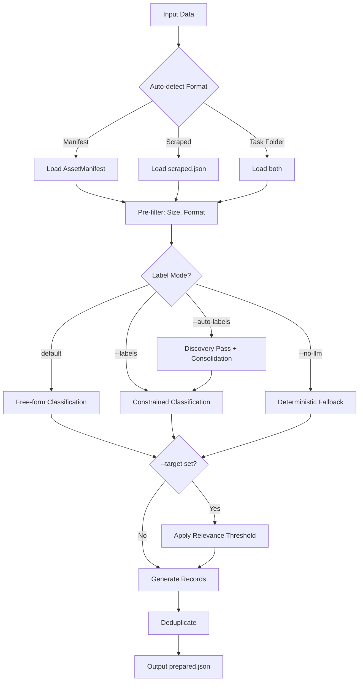

### Template I/O Specifications

#### 1. raw-extract Template

**Input:** Array of `ScrapedPage` objects from scraped JSON

```json
{
  "id": "page_0",
  "source_url": "https://example.com/article",
  "title": "Article Title",
  "text": "Full article text content...",
  "links": ["https://link1.com"],
  "crawled_at": "2025-03-02T10:00:00Z",
  "depth": 0
}
```

**Output:** Cleaned records with metadata

```json
{
  "id": "page_0",
  "source_url": "https://example.com/article",
  "title": "Article Title",
  "text": "Cleaned text...",
  "crawled_at": "2025-03-02T10:00:00Z",
  "depth": 0,
  "_meta": {
    "sourceUrl": "https://example.com/article",
    "sourceTitle": "Article Title",
    "template": "raw-extract",
    "processedAt": "2025-03-02T10:00:00Z"
  }
}
```

---

#### 2. text-instruct Template

**Input:** Array of `ScrapedPage` objects

**Output:** Instruction-following pairs

```json
{
  "instruction": "Summarize the key points",
  "input": "The article discusses...",
  "output": "Key points: 1) First point, 2) Second point",
  "source_url": "https://example.com/article",
  "title": "Article Title",
  "_meta": {
    "sourceUrl": "https://example.com/article",
    "sourceTitle": "Article Title",
    "template": "text-instruct",
    "relevanceScore": 0.9,
    "isRelevant": true,
    "processedAt": "2025-03-02T10:00:00Z"
  }
}
```

---

#### 3. text-qa Template

**Input:** Array of `ScrapedPage` objects

**Output:** Question-answer pairs

```json
{
  "instruction": "What is the main topic?",
  "output": "The article discusses artificial intelligence and machine learning...",
  "source_url": "https://example.com/article",
  "title": "Article Title",
  "_meta": {
    "sourceUrl": "https://example.com/article",
    "sourceTitle": "Article Title",
    "template": "text-qa",
    "relevanceScore": 0.85,
    "isRelevant": true,
    "processedAt": "2025-03-02T10:00:00Z"
  }
}
```

---

#### 4. text-conversation Template

**Input:** Array of `ScrapedPage` objects

**Output:** Multi-turn conversations

```json
{
  "conversation": [
    { "role": "user", "content": "Can you explain this concept?" },
    { "role": "assistant", "content": "Certainly! This concept refers to..." },
    { "role": "user", "content": "Can you give an example?" },
    { "role": "assistant", "content": "Here's a practical example..." }
  ],
  "source_url": "https://example.com/article",
  "title": "Article Title",
  "_meta": {
    "sourceUrl": "https://example.com/article",
    "sourceTitle": "Article Title",
    "template": "text-conversation",
    "relevanceScore": 0.88,
    "isRelevant": true,
    "processedAt": "2025-03-02T10:00:00Z"
  }
}
```

---

#### 5. image-classification Template

**Input:** Array of `AssetRecord` objects from downloads manifest

```json
{
  "id": "asset_0",
  "sourceUrl": "https://example.com/image.jpg",
  "sourcePageUrl": "https://example.com/page",
  "sourcePageTitle": "Page Title",
  "localPath": "downloads/images/image.jpg",
  "fileName": "image.jpg",
  "fileType": "image",
  "fileSize": 245760,
  "context": {
    "altText": "A red sports car",
    "surroundingText": "Check out this car",
    "pageDepth": 0,
    "tags": ["cars", "sports"]
  }
}
```

**Output:** Classification records

```json
{
  "image": "downloads/images/image.jpg",
  "label": "sports_car",
  "caption": "A red Ferrari sports car",
  "relevance": 0.92,
  "fileName": "image.jpg",
  "_meta": {
    "sourceUrl": "https://example.com/image.jpg",
    "sourceTitle": "Page Title",
    "assetId": "asset_0",
    "template": "image-classification",
    "relevanceScore": 0.92,
    "isRelevant": true,
    "processedAt": "2025-03-02T10:00:00Z",
    "generationMethod": "llm",
    "labelSource": "vllm"
  }
}
```

> `labelSource` values: `"vllm"` (free-form), `"user_labels"` (`--labels`), `"auto_discovered"` (`--auto-labels`), `"deterministic"` (`--no-llm`)

---

#### 6. image-captioning Template

**Input:** Array of `AssetRecord` objects

**Output:** Image caption records

```json
{
  "image": "downloads/images/image.jpg",
  "caption": "A sleek red sports car parked in front of a modern building",
  "text": "This Ferrari showcases Italian engineering excellence...",
  "fileName": "image.jpg",
  "sourceUrl": "https://example.com/image.jpg",
  "_meta": {
    "sourceUrl": "https://example.com/image.jpg",
    "sourceTitle": "Page Title",
    "assetId": "asset_0",
    "template": "image-captioning",
    "processedAt": "2025-03-02T10:00:00Z"
  }
}
```

---

#### 7. vision-qa Template

**Input:** Array of `AssetRecord` objects

**Output:** Visual Q&A records (ready for LLaVA formatter)

```json
{
  "image": "downloads/images/image.jpg",
  "conversations": [
    { "from": "human", "value": "<image>\nWhat type of car is this?" },
    {
      "from": "gpt",
      "value": "This is a red Ferrari sports car, likely a 458 Italia model based on its distinctive styling."
    },
    { "from": "human", "value": "<image>\nWhat color is it?" },
    { "from": "gpt", "value": "The car is bright red (Rosso Corsa)." }
  ],
  "fileName": "image.jpg",
  "sourceUrl": "https://example.com/image.jpg",
  "_meta": {
    "sourceUrl": "https://example.com/image.jpg",
    "sourceTitle": "Page Title",
    "assetId": "asset_0",
    "template": "vision-qa",
    "relevanceScore": 0.95,
    "isRelevant": true,
    "processedAt": "2025-03-02T10:00:00Z"
  }
}
```

---

#### 8. audio-classification Template

**Input:** Array of `AssetRecord` objects with audio files

**Output:** Audio classification records

```json
{
  "audio": "downloads/audio/clip.wav",
  "label": "music",
  "confidence": 0.94,
  "description": "Upbeat instrumental music with guitar and drums",
  "_meta": {
    "sourceUrl": "https://example.com/audio.wav",
    "sourceTitle": "Audio Page",
    "assetId": "asset_0",
    "template": "audio-classification",
    "processedAt": "2025-03-02T10:00:00Z"
  }
}
```

---

## Downloads Manifest Reference

The downloads manifest is automatically generated during the scrape phase and tracks metadata for every downloaded asset.

### Manifest Schema

```typescript
interface AssetManifest {
  taskId: string; // Task identifier
  searchQuery: string | null; // Original search query
  generatedAt: string; // ISO 8601 timestamp
  totalAssets: number; // Total asset count
  version: string; // Manifest format version
  assets: AssetRecord[]; // Per-file records
}

interface AssetRecord {
  id: string; // Unique asset ID: "asset_0", "asset_1"
  sourceUrl: string; // Direct download URL
  sourcePageUrl: string; // Page where link was found
  sourcePageTitle: string; // Title of source page
  localPath: string; // Relative path: "downloads/images/car.jpg"
  fileName: string; // File name
  fileType: string; // "image" | "video" | "pdf" | etc.
  fileSize: number; // Bytes
  status: string; // "completed" | "failed" | "skipped"
  downloadedAt: string; // ISO timestamp
  duration: number; // Download duration in ms
  context: {
    altText: string | null; // Image alt text
    surroundingText: string | null; // Text around link
    pageDepth: number; // Crawl depth
    tags: string[]; // Auto-extracted keywords
  };
  relevance: {
    score: number | null; // Populated by transform command
    matchesTarget: boolean | null;
    reason: string | null;
  };
}
```

### Example Manifest

```json
{
  "taskId": "task_1740764800000_abc123",
  "searchQuery": "sports cars",
  "generatedAt": "2025-02-28T12:00:00.000Z",
  "totalAssets": 3,
  "version": "1.0.0",
  "assets": [
    {
      "id": "asset_0",
      "sourceUrl": "https://example.com/car1.jpg",
      "sourcePageUrl": "https://example.com/gallery",
      "sourcePageTitle": "Sports Cars Gallery",
      "localPath": "downloads/images/car1.jpg",
      "fileName": "car1.jpg",
      "fileType": "image",
      "fileSize": 245760,
      "status": "completed",
      "downloadedAt": "2025-02-28T12:00:05.000Z",
      "duration": 500,
      "context": {
        "altText": "Red sports car",
        "surroundingText": "Check out this amazing sports car collection",
        "pageDepth": 0,
        "tags": ["cars", "gallery", "sports"]
      },
      "relevance": {
        "score": null,
        "matchesTarget": null,
        "reason": null
      }
    }
  ]
}
```

### Using the Manifest

```bash
# View manifest contents
cat output/task_xxx/downloads/downloads_manifest.json | jq

# Extract completed assets
jq '.assets[] | select(.status == "completed") | .localPath' output/task_xxx/downloads/downloads_manifest.json

# Get assets with specific tags
jq '.assets[] | select(.context.tags[] | contains("sports")) | .fileName' output/task_xxx/downloads/downloads_manifest.json

# Transform uses manifest automatically
npm start -- transform -i output/task_xxx -t image-classification --target "sports cars"
```

### Tag Extraction

Tags are automatically extracted from:

- **URL path segments**: `/photos/cars/sports/` → `["photos", "cars", "sports"]`
- **Page title words**: "Sports Cars Gallery" → `["sports", "cars", "gallery"]`
- **Domain name**: `github.com` → `["github"]`

Stop words ("the", "and", "in", etc.) are filtered out. Tags are sorted alphabetically.

---

## Pipeline Stage Documentation

### Stage 1: Load & Format Detection

The format detection stage automatically identifies input format:

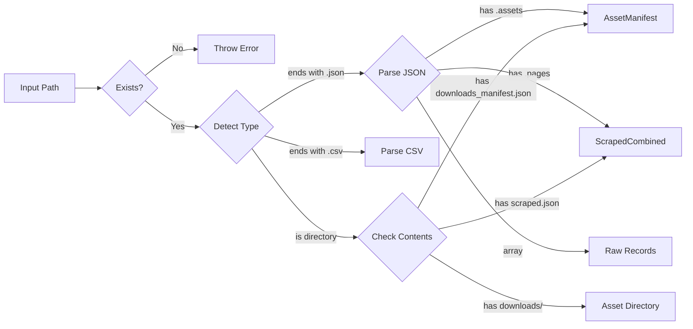

**Supported Input Formats:**

| Format          | Extension | Detection Pattern                   |
| --------------- | --------- | ----------------------------------- |
| AssetManifest   | `.json`   | Has `assets` array with `sourceUrl` |
| ScrapedCombined | `.json`   | Has `pages` array with `source_url` |
| Raw Records     | `.json`   | Array of objects                    |
| CSV             | `.csv`    | Comma-separated values              |
| Task Folder     | directory | Contains manifest or scraped data   |

### Stage 2: Cleanup

The cleanup pipeline processes records before formatting:

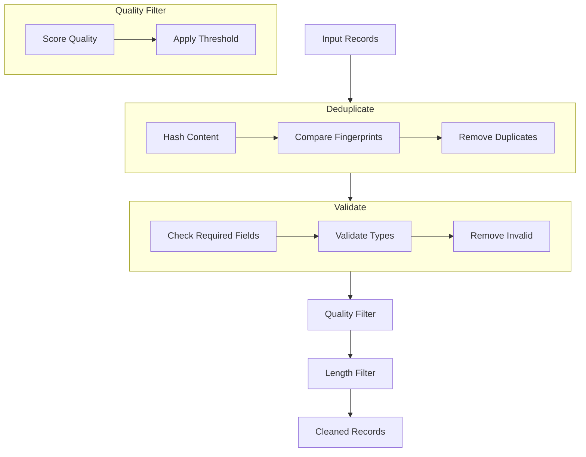

**Cleanup Options:**

| Option                | Description                      |
| --------------------- | -------------------------------- |
| `--cleanup-dedupe`    | Remove duplicate records         |
| `--cleanup-validate`  | Validate record structure        |
| `--cleanup-quality`   | Apply quality scoring            |
| `--quality-threshold` | Quality score threshold (0-10)   |
| `--min-length`        | Minimum text length              |
| `--max-length`        | Maximum text length              |
| `--remove-empty`      | Remove records with empty fields |

### Stage 3: Validate

Each formatter has specific validation requirements:

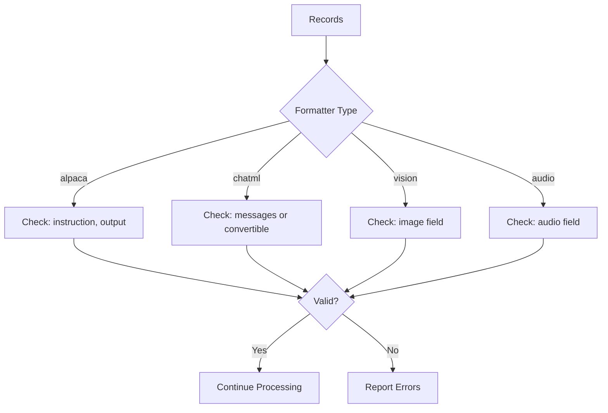

**Required Fields by Formatter:**

| Formatter   | Required Fields                        | Optional Fields        |
| ----------- | -------------------------------------- | ---------------------- |
| alpaca      | `instruction`, `output`                | `input`                |
| chatml      | `messages` or `role`+`content`         | `conversation_id`      |
| sharegpt    | `conversations` or `human`+`assistant` | `system`               |
| oasst       | `message_id`, `text`                   | `parent_id`, `tree_id` |
| raw         | `prompt`, `completion`                 | -                      |
| llava       | `image`, `conversations`               | `id`                   |
| imagefolder | `image`, `label`                       | -                      |
| coco        | `image`, `bbox`, `category`            | `category_id`          |
| yolo        | `image`, `bbox`, `class`               | -                      |
| audiofolder | `audio`, `label`                       | -                      |
| speech-text | `audio`, `text`                        | `duration`             |
| datasetdict | Any valid fields                       | -                      |
| parquet     | Any valid fields                       | -                      |

### Stage 4: Field Mapping

Field mapping transforms source data to target structure:

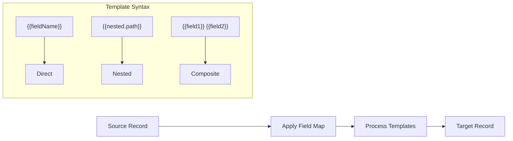

**Template Syntax:**

- `{{fieldName}}` - Direct field reference
- `{{nested.path}}` - Nested object access (e.g., `{{meta.author.name}}`)
- `"{{first}} {{last}}"` - Composite template combining multiple fields
- `{{items[0].title}}` - Array indexing

**Example Mapping:**

```json
{
  "instruction": "Summarize: {{meta.title}}",
  "input": "{{content.body}}",
  "output": "{{content.summary}}"
}
```

### Stage 5: Split

Train/validation/test splitting with optional stratification:

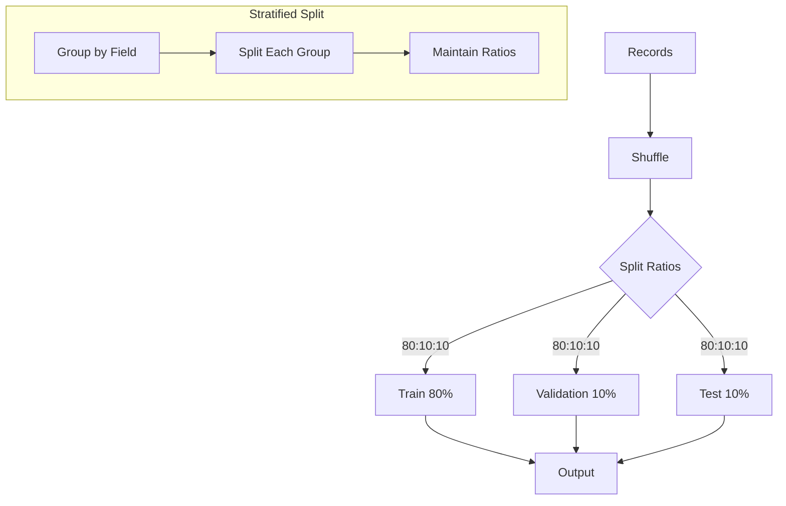

**Split Ratio Examples:**

| Ratio      | Train | Validation | Test |
| ---------- | ----- | ---------- | ---- |
| `80:10:10` | 80%   | 10%        | 10%  |
| `70:15:15` | 70%   | 15%        | 15%  |
| `90:5:5`   | 90%   | 5%         | 5%   |
| `60:20:20` | 60%   | 20%        | 20%  |

**Stratified Splitting:**

Use `--stratified-field category` to maintain class distribution across splits. Each unique value in the specified field will be distributed proportionally.

### Stage 6: Output

Output routing by formatter:

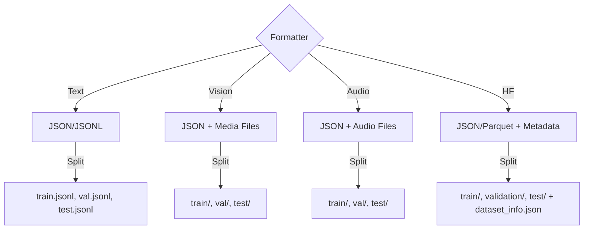

**Output Structure:**

```
output/
├── metadata.json           # Dataset metadata
├── dataset_info.json       # HF dataset info
├── train/
│   ├── data.jsonl
│   └── media/             # For vision/audio
├── validation/
│   └── data.jsonl
└── test/
    └── data.jsonl
```

---

## Formatter Reference Cards

### Text Formatters

#### 1. alpaca - Stanford Instruction Format

**Purpose:** Instruction-following datasets for fine-tuning LLMs

**Input:** Records with `{instruction, input?, output}` fields

```json
{
  "instruction": "Summarize this article",
  "input": "The article text content...",
  "output": "Summary of the article..."
}
```

**Output:** `data.json` with Alpaca format

```json
[
  {
    "instruction": "Summarize this article",
    "input": "The article text content...",
    "output": "Summary of the article..."
  }
]
```

**CLI:**

```bash
npm start -- format -i data.json -f alpaca -o output/
npm start -- format -i data.json -f alpaca --include-empty-input false --default-input "N/A"
```

**Options:**

| Option                  | Description                    | Default |
| ----------------------- | ------------------------------ | ------- |
| `--include-empty-input` | Include empty input field      | `true`  |
| `--default-input`       | Default value for empty inputs | `""`    |

**Example Output:**

```json
{
  "instruction": "Explain quantum computing",
  "input": "",
  "output": "Quantum computing uses quantum bits..."
}
```

**Gotchas:**

- Empty `input` field is included by default; use `--include-empty-input false` to omit

---

#### 2. chatml - OpenAI Chat Markup

**Purpose:** Conversational AI training with role-based messages

**Input:** Records with `messages` or `{instruction, output}` fields

```json
{
  "messages": [
    { "role": "user", "content": "Hello" },
    { "role": "assistant", "content": "Hi there!" }
  ]
}
```

Or from instruction/output:

```json
{
  "instruction": "Explain quantum computing",
  "output": "Quantum computing uses quantum bits..."
}
```

**Output:** ChatML format with messages array

```json
[
  {
    "messages": [
      { "role": "system", "content": "You are a helpful assistant" },
      { "role": "user", "content": "Hello" },
      { "role": "assistant", "content": "Hi there!" }
    ]
  }
]
```

**CLI:**

```bash
npm start -- format -i data.json -f chatml -o output/ --split 80:10:10
npm start -- format -i data.json -f chatml --conversation-id-field conv_id --role-map '{"user":"question","assistant":"answer"}'
```

**Options:**

| Option                    | Description                             |
| ------------------------- | --------------------------------------- |
| `--conversation-id-field` | Group records into conversations        |
| `--role-map`              | JSON mapping of custom fields to roles  |
| `--include-system`        | Include system messages (default: true) |

**Example Output:**

```json
{
  "messages": [
    { "role": "system", "content": "You are helpful" },
    { "role": "user", "content": "Hello" },
    { "role": "assistant", "content": "Hi there!" }
  ]
}
```

**Gotchas:**

- Multi-turn conversations require `conversation-id-field` for grouping

---

#### 3. sharegpt - Multi-Turn Conversation

**Purpose:** Conversational datasets with human/assistant turns

**Input:** Records with `conversations` or `{human, assistant}` fields

```json
{
  "conversations": [
    { "from": "human", "value": "What's 2+2?" },
    { "from": "gpt", "value": "2+2 equals 4." }
  ]
}
```

Or from separate fields:

```json
{
  "human": "What is machine learning?",
  "assistant": "Machine learning is a subset of AI..."
}
```

**Output:** ShareGPT format with conversations array

```json
[
  {
    "conversations": [
      { "from": "human", "value": "What is machine learning?" },
      { "from": "gpt", "value": "Machine learning is a subset of AI..." }
    ]
  }
]
```

**CLI:**

```bash
npm start -- format -i data.json -f sharegpt -o output/
npm start -- format -i data.json -f sharegpt --conversation-field thread_id --human-field question --assistant-field answer
```

**Options:**

| Option                 | Description                    |
| ---------------------- | ------------------------------ |
| `--conversation-field` | Group records by field         |
| `--human-field`        | Custom human message field     |
| `--assistant-field`    | Custom assistant message field |

**Example Output:**

```json
{
  "conversations": [
    { "from": "human", "value": "What's 2+2?" },
    { "from": "gpt", "value": "2+2 equals 4." }
  ]
}
```

**Gotchas:**

- Field mapping required if source uses custom field names

---

#### 4. oasst - OpenAssistant Tree Format

**Purpose:** Threaded conversation trees with parent-child relationships

**Input:** Records with message tree structure

```json
{
  "message_id": "msg_001",
  "parent_id": null,
  "tree_id": "tree_001",
  "text": "What is AI?",
  "role": "prompter"
}
```

**Output:** OASST format with tree structure

```json
[
  {
    "message_id": "msg_001",
    "tree_id": "tree_001",
    "parent_id": null,
    "text": "What is AI?",
    "role": "prompter",
    "lang": "en"
  },
  {
    "message_id": "msg_002",
    "tree_id": "tree_001",
    "parent_id": "msg_001",
    "text": "AI stands for Artificial Intelligence...",
    "role": "assistant",
    "lang": "en"
  }
]
```

```bash
npm start -- format -i data.json -f oasst -o output/
npm start -- format -i data.json -f oasst --tree-id-field thread_id --parent-id-field reply_to --lang en
```

**Options:**

| Option              | Description                    |
| ------------------- | ------------------------------ |
| `--tree-id-field`   | Custom tree ID field           |
| `--parent-id-field` | Custom parent message ID field |
| `--lang`            | Language code (e.g., "en")     |

**Example Output:**

```json
{
  "message_id": "msg_001",
  "tree_id": "tree_001",
  "parent_id": null,
  "text": "Hello",
  "role": "prompter",
  "lang": "en"
}
```

**Gotchas:**

- Tree structure validation required for proper threading

---

#### 5. raw - Simple Prompt/Completion

**Purpose:** Simple prompt-response datasets

**Input:** Records with `{prompt, completion}` fields

```json
{
  "prompt": "What is AI?",
  "completion": "AI is..."
}
```

**Output:** Simple JSONL format

```json
[
  { "prompt": "What is AI?", "completion": "AI is..." },
  { "prompt": "Explain ML", "completion": "ML is..." }
]
```

```bash
npm start -- format -i data.json -f raw -o output/
```

**Example Output:**

```json
{ "prompt": "What is AI?", "completion": "AI is..." }
```

**Gotchas:**

- Most basic format with no special options

---

### Vision Formatters

#### 6. llava - Multimodal LLM Format

**Purpose:** Vision-language model training (LLaVA-style)

**Input:** Records with `{image, conversations}` or `{image, instruction, output}` fields

```json
{
  "image": "path/to/image.jpg",
  "conversations": [
    { "from": "human", "value": "What is shown in this image?" },
    { "from": "gpt", "value": "A red sports car" }
  ]
}
```

Or from vision-qa transform output:

```json
{
  "image": "downloads/images/car.jpg",
  "conversations": [
    { "from": "human", "value": "<image>\nWhat type of car is this?" },
    { "from": "gpt", "value": "This is a Ferrari sports car" }
  ]
}
```

**Output:** LLaVA format with conversations array

```json
[
  {
    "image": "images/car_001.jpg",
    "conversations": [
      { "from": "human", "value": "<image>\nWhat type of car is this?" },
      { "from": "gpt", "value": "This is a red Ferrari sports car" }
    ]
  }
]
```

**CLI:**

```bash
npm start -- format -i data.json -f llava -o output/
npm start -- format -i data.json -f llava --image-token "<image>" --embed-images --max-embed-size 2097152
```

**Options:**

| Option             | Description                 | Default         |
| ------------------ | --------------------------- | --------------- |
| `--image-token`    | Image placeholder token     | `<image>`       |
| `--embed-images`   | Embed images as base64      | `false`         |
| `--max-embed-size` | Max size for base64 (bytes) | `2097152` (2MB) |

**Example Output:**

```json
{
  "image": "path/to/image.jpg",
  "conversations": [
    { "from": "human", "value": "<image>\nWhat is this?" },
    { "from": "gpt", "value": "A sports car." }
  ]
}
```

**Gotchas:**

- Image token placement in conversation text
- Base64 embedding limited to 2MB by default

---

#### 7. imagefolder - HuggingFace ImageFolder

**Purpose:** Image classification datasets

**Input:** Records with `{image, label}` fields

```json
{
  "image": "downloads/images/car.jpg",
  "label": "sports_car",
  "confidence": 0.92
}
```

**Output:** Directory structure with class folders

```
output/
├── sports_car/
│   ├── img1.jpg
│   └── img2.jpg
└── sedan/
    └── img3.jpg
```

**CLI:**

```bash
npm start -- format -i data.json -f imagefolder -o output/ --class-field label --copy-media
```

**Options:**

| Option               | Description                          |
| -------------------- | ------------------------------------ |
| `--class-field`      | Field containing class label         |
| `--image-extensions` | Allowed extensions (comma-separated) |
| `--copy-media`       | Copy media files (default: symlink)  |

**Example Output:**

```
output/
├── class_a/
│   ├── img1.jpg
│   └── img2.jpg
└── class_b/
    └── img3.jpg
```

**Gotchas:**

- Always copies files (no symlink option for HF compatibility)

---

#### 8. csv-images - CSV + Image References

**Purpose:** Tabular data with image paths

**Input:** Records with `{image, ...metadata}` fields

```json
{
  "image": "downloads/img1.jpg",
  "label": "car",
  "title": "Sports Car",
  "category": "automotive"
}
```

**Output:** CSV with image paths + metadata JSON

```csv
image_path,label,title,category
"downloads/img1.jpg","car","Sports Car","automotive"
"downloads/img2.jpg","truck","Big Truck","automotive"
```

Accompanied by `metadata.json`:

```json
[
  {
    "image_path": "downloads/img1.jpg",
    "label": "car",
    "title": "Sports Car"
  }
]
```

```bash
npm start -- format -i data.json -f csv-images -o output/
```

**Options:**

| Option             | Description                       |
| ------------------ | --------------------------------- |
| `--include-fields` | Comma-separated fields to include |
| `--exclude-fields` | Comma-separated fields to exclude |

**Example Output:**

```csv
image_path,label,title
downloads/img1.jpg,car,Sports Car
downloads/img2.jpg,truck,Big Truck
```

**Gotchas:**

- Paths must be resolvable from output directory

---

#### 9. coco - COCO Object Detection

**Purpose:** Object detection with bounding boxes

**Input:** Records with `{image, bbox, category}` fields

```json
{
  "image": "downloads/img1.jpg",
  "bbox": [100, 200, 50, 80],
  "category": "car",
  "category_id": 1
}
```

**Output:** COCO JSON format

```json
{
  "images": [{ "id": 1, "file_name": "img1.jpg", "width": 1920, "height": 1080 }],
  "annotations": [
    { "id": 1, "image_id": 1, "category_id": 1, "bbox": [100, 200, 50, 80], "area": 4000 }
  ],
  "categories": [
    { "id": 1, "name": "car" },
    { "id": 2, "name": "person" }
  ]
}
```

**CLI:**

```bash
npm start -- format -i data.json -f coco -o output/
```

**Options:**

| Option                  | Description                   |
| ----------------------- | ----------------------------- |
| `--bbox-field`          | Field containing bounding box |
| `--category-id-field`   | Field for category ID         |
| `--category-name-field` | Field for category name       |

**BBox Format:** `[x, y, width, height]` (COCO format)

**Example Output:**

```json
{
  "images": [{ "id": 1, "file_name": "img1.jpg" }],
  "annotations": [{ "id": 1, "image_id": 1, "category_id": 1, "bbox": [100, 200, 50, 80] }],
  "categories": [{ "id": 1, "name": "car" }]
}
```

**Gotchas:**

- No segmentation masks supported (use polygon approximation)

---

#### 10. yolo - YOLO Detection Format

**Purpose:** YOLO training format

**Input:** Records with `{image, bbox, class}` fields

```json
{
  "image": "downloads/img1.jpg",
  "bbox": [100, 200, 50, 80],
  "class": "car",
  "class_id": 0
}
```

**Output:** YOLO txt files per image

```
output/
├── images/
│   ├── train/
│   │   └── img1.jpg
│   └── val/
│       └── img2.jpg
├── labels/
│   ├── train/
│   │   └── img1.txt    # "0 0.078 0.278 0.026 0.074"
│   └── val/
│       └── img2.txt
└── classes.txt         # "car\nperson\ntruck"
```

**CLI:**

```bash
npm start -- format -i data.json -f yolo -o output/ --image-width 1920 --image-height 1080
```

**Options:**

| Option           | Description                    |
| ---------------- | ------------------------------ |
| `--image-width`  | Image width for normalization  |
| `--image-height` | Image height for normalization |
| `--copy-media`   | Copy images to output          |

**BBox Format:** `[class_id, center_x, center_y, width, height]` (normalized 0-1)

**Example Output:**

```
output/
├── images/
│   └── img1.jpg
├── labels/
│   └── img1.txt  # "0 0.5 0.5 0.3 0.4"
└── classes.txt   # "car\ntruck\nperson"
```

**Gotchas:**

- Requires image dimensions for coordinate normalization
- Use `--image-width`/`--image-height` or pre-calculate

---

### Audio Formatters

#### 11. audiofolder - HuggingFace AudioFolder

**Purpose:** Audio classification datasets

**Input:** Records with `{audio, label}` fields

```json
{
  "audio": "downloads/audio/clip1.wav",
  "label": "speech",
  "confidence": 0.94
}
```

**Output:** Directory structure with class folders

```
output/
├── speech/
│   ├── clip1.wav
│   └── clip2.wav
└── music/
    └── clip3.wav
```

**CLI:**

```bash
npm start -- format -i data.json -f audiofolder -o output/ --class-field label --audio-field audio
```

**Options:**

| Option               | Description                          |
| -------------------- | ------------------------------------ |
| `--class-field`      | Field containing class label         |
| `--audio-extensions` | Allowed extensions (comma-separated) |
| `--copy-media`       | Copy audio files                     |

**Example Output:**

```
output/
├── speech/
│   ├── clip1.wav
│   └── clip2.wav
└── music/
    └── clip3.wav
```

**Gotchas:**

- Audio files always copied (not symlinked)

---

#### 12. speech-text - ASR/TTS Format

**Purpose:** Speech recognition datasets

**Input:** Records with `{audio, text}` fields

```json
{
  "audio": "audio/clip1.wav",
  "text": "Hello world, this is a test"
}
```

**Output:** Metadata CSV + audio files

```json
[
  {
    "audio": "audio/clip1.wav",
    "text": "Hello world, this is a test",
    "duration": 2.5
  }
]
```

**CLI:**

```bash
npm start -- format -i data.json -f speech-text -o output/ --audio-field audio --text-field text --extract-duration
```

**Options:**

| Option               | Description                     |
| -------------------- | ------------------------------- |
| `--audio-field`      | Field containing audio path     |
| `--text-field`       | Field containing transcription  |
| `--duration-field`   | Pre-existing duration field     |
| `--extract-duration` | Use ffprobe to extract duration |
| `--copy-media`       | Copy audio files                |

**Example Output:**

```json
{
  "audio": "audio/clip1.wav",
  "text": "Hello world",
  "duration": 2.5
}
```

**Gotchas:**

- Requires `ffprobe` for `--extract-duration`

---

### HuggingFace Formatters

#### 13. datasetdict - HuggingFace DatasetDict

**Purpose:** Split datasets for HuggingFace `datasets` library

**Input:** Any formatted data (from other formatters)

```json
{
  "instruction": "Explain AI",
  "output": "AI is..."
}
```

**Output:** DatasetDict with train/val/test splits

```
output/
├── train/
│   └── data.json       # 80% of data
├── validation/
│   └── data.json       # 10% of data
├── test/
│   └── data.json       # 10% of data
└── dataset_card.md     # If --generate-card
```

**CLI:**

```bash
npm start -- format -i data.json -f datasetdict -o output/ --split 80:10:10 --generate-card
npm start -- format -i data.json -f datasetdict -o output/ --stratified-field category --output-format parquet
```

**Options:**

| Option               | Description                    |
| -------------------- | ------------------------------ |
| `--output-format`    | `json` or `parquet`            |
| `--features`         | HF features schema JSON        |
| `--stratified-field` | Field for stratified splitting |
| `--generate-card`    | Generate dataset card          |
| `--license`          | Dataset license                |
| `--card-language`    | Language codes                 |
| `--task-categories`  | Task categories                |

**Example Output:**

```
output/
├── dataset_info.json
├── README.md (dataset card)
├── train/
│   └── data.json
├── validation/
│   └── data.json
└── test/
    └── data.json
```

**Gotchas:**

- Stratified splitting requires categorical field

---

#### 14. parquet - Parquet Output

**Purpose:** Columnar storage for ML training

**Input:** Any formatted data

```json
{
  "instruction": "Explain AI",
  "output": "AI is...",
  "category": "technology"
}
```

**Output:** Parquet files per split

```
output/
├── train/
│   └── data.parquet    # Columnar format for fast loading
├── validation/
│   └── data.parquet
└── test/
    └── data.parquet
```

**CLI:**

```bash
npm start -- format -i data.json -f parquet -o output/ --split 80:10:10 --generate-card
```

**Options:**

| Option               | Description                    |
| -------------------- | ------------------------------ |
| `--stratified-field` | Field for stratified splitting |
| `--generate-card`    | Generate dataset card          |

**Example Output:**

```
output/
├── train/
│   └── data.parquet
├── validation/
│   └── data.parquet
└── test/
    └── data.parquet
```

**Gotchas:**

- Schema auto-inferred from data

---

## End-to-End Walkthroughs

### Walkthrough 1: Scraped Web Articles → Alpaca

**Scenario:** Scrape AI news articles and convert to Alpaca instruction format.

```bash
# Step 1: Scrape AI news
npm start -- scrape --search "AI news" --search-count 20 --download

# Step 2: Transform to instruction format
npm start -- transform -i output/task_xxx -t text-instruct \
  --target "artificial intelligence" \
  -o prepared.json

# Step 3: Format to Alpaca with cleanup and split
npm start -- format -i prepared.json -f alpaca -o output/ \
  --cleanup --cleanup-dedupe --split 80:10:10 \
  --field-map '{"instruction":"{{question}}","output":"{{answer}}"}'
```

**Result:** `output/train/alpaca.jsonl`, `output/validation/alpaca.jsonl`, `output/test/alpaca.jsonl`

---

### Walkthrough 2: Q&A CSV → ChatML

**Scenario:** Convert existing Q&A CSV to ChatML conversational format.

```bash
# Step 1: Import and transform CSV
npm start -- import -f qa-data.csv -o imported.json

# Step 2: Transform to conversation format
npm start -- transform -i imported.json -t text-conversation \
  --no-llm -o prepared.json

# Step 3: Format to ChatML with conversation grouping
npm start -- format -i prepared.json -f chatml -o output/ \
  --conversation-id-field thread_id \
  --split 80:10:10
```

**Result:** Multi-turn conversations grouped by `thread_id`

---

### Walkthrough 3: Car Images → ImageFolder

**Scenario:** Download car images and create image classification dataset.

```bash
# Step 1: Scrape car images
npm start -- scrape --search "sports cars" --download --formats image

# Step 2: Transform with vision classification
npm start -- transform -i output/task_xxx \
  -t image-classification \
  --target "sports cars" \
  -m "kimi-k2.5:cloud" \
  -o prepared.json

# Step 3: Format to ImageFolder
npm start -- format -i prepared.json -f imagefolder -o output/ \
  --class-field label --copy-media --split 80:10:10
```

**Result:**

```
output/
├── sports_car/
│   └── [images]
├── sedan/
│   └── [images]
└── suv/
    └── [images]
```

---

### Walkthrough 4: Object Detection → COCO/YOLO

**Scenario:** Convert annotated bounding boxes to detection formats.

```bash
# Input: data.json with bboxes in [x, y, w, h] format

# Format to COCO
npm start -- format -i data.json -f coco -o coco_output/ \
  --bbox-field bbox --category-name-field class

# Format to YOLO (requires image dimensions)
npm start -- format -i data.json -f yolo -o yolo_output/ \
  --image-width 1920 --image-height 1080 \
  --bbox-field bbox --class-field class
```

**COCO Result:** `annotations.json` with images, annotations, categories

**YOLO Result:** `images/` + `labels/` + `classes.txt` + `data.yaml`

---

### Walkthrough 5: Speech Dataset → Speech-Text

**Scenario:** Prepare speech recognition dataset with transcriptions.

```bash
# Input: audio files + transcriptions in data.json

# Format to speech-text with duration extraction
npm start -- format -i data.json -f speech-text -o output/ \
  --audio-field audio_path \
  --text-field transcription \
  --extract-duration \
  --copy-media
```

**Result:**

```
output/
├── metadata.csv        # audio_path, text, duration
├── data.jsonl        # Full records
└── audio/            # Copied audio files
    └── [audio files]
```

---

### Walkthrough 6: Any Data → HuggingFace DatasetDict

**Scenario:** Create production-ready HuggingFace dataset.

```bash
# Format with stratified split and dataset card
npm start -- format -i data.json -f datasetdict -o output/ \
  --split 80:10:10 \
  --stratified-field category \
  --output-format parquet \
  --generate-card \
  --license mit \
  --card-language "en" \
  --task-categories "text-generation,text-classification"
```

**Result:**

```
output/
├── README.md              # Dataset card
├── dataset_info.json      # HF metadata
├── train/
│   └── data.parquet
├── validation/
│   └── data.parquet
└── test/
    └── data.parquet
```

**Load in Python:**

```python
from datasets import load_dataset
dataset = load_dataset("path/to/output")
```

---

### Walkthrough 7: Images → LLaVA (Multimodal)

**Scenario:** Create a vision-language dataset for training multimodal LLMs using LLaVA format.

This walkthrough combines the `transform` command's `vision-qa` template with the `llava` formatter to create conversational vision-language training data from scraped images.

```bash
# Step 1: Scrape images with download
npm start -- scrape --search "sports cars" --download --formats image --search-count 20

# Step 2: Transform to vision-qa format (creates conversational Q&A pairs)
npm start -- transform -i output/task_xxx -t vision-qa \
  --target "sports cars" \
  -o prepared.json \
  --yes

# Step 3: Format to LLaVA with media copying and train/val/test split
npm start -- format -i prepared.json -f llava -o llava-dataset/ \
  --copy-media \
  --split 80:10:10
```

**Data Flow:**

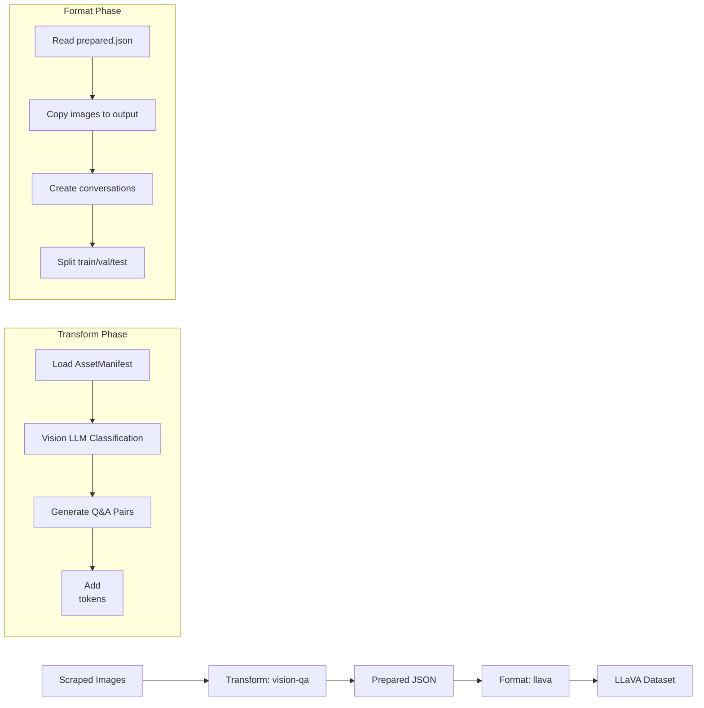

**Result Structure:**

```
llava-dataset/
├── data.json              # Full dataset
├── data.jsonl             # JSONL version
├── images/                # Copied images
│   ├── car_001.jpg
│   ├── car_002.jpg
│   └── ...
├── train/
│   ├── data.json          # Training split
│   └── images/            # Training images
├── validation/
│   ├── data.json          # Validation split
│   └── images/            # Validation images
└── test/
    ├── data.json          # Test split
    └── images/            # Test images
```

**Sample Output (data.json):**

```json
[
  {
    "image": "images/car_001.jpg",
    "conversations": [
      {
        "from": "human",
        "value": "<image>\nWhat type of car is this?"
      },
      {
        "from": "gpt",
        "value": "This is a red Ferrari sports car."
      },
      {
        "from": "human",
        "value": "<image>\nWhat color is it?"
      },
      {
        "from": "gpt",
        "value": "The car is bright red (Rosso Corsa)."
      }
    ]
  }
]
```

**Integration Notes:**

- The `vision-qa` template automatically adds `<image>` tokens to conversation values
- Images are copied (not symlinked) when using `--copy-media`
- Each split gets its own `images/` subdirectory for isolation
- Compatible with LLaVA training scripts and HuggingFace `load_dataset()`

---

## Known Limitations and Troubleshooting

### Known Gaps and Limitations

| Severity | Formatter        | Limitation                               | Workaround                                         |
| -------- | ---------------- | ---------------------------------------- | -------------------------------------------------- |
| Low      | COCO             | No segmentation masks                    | Use polygon approximation                          |
| Medium   | YOLO             | Requires image dimensions pre-calculated | Use `--image-width`/`--height` or ffprobe          |
| Low      | LLaVA            | No embedded image support >2MB           | Use `--max-embed-size` or paths                    |
| Low      | Speech-Text      | ffprobe required for duration            | Install ffmpeg or provide pre-calculated durations |
| Medium   | Stratified Split | Requires categorical field               | Ensure field has discrete values                   |

### Expanded Troubleshooting

#### Transform Issues

**"No valid records found"**

- Check input file format (manifest, scraped, or raw JSON)
- Verify `--asset-dir` points to correct downloads directory
- Try `--no-llm` mode to bypass LLM classification

**"Vision model not available"**

- Verify model name with `npm start -- generate --list-models`
- For local models, ensure Ollama is running

**Low relevance scores**

- Lower `--relevance-threshold` (e.g., `0.5`)
- Broaden `--target` description
- Use `--no-llm` for deterministic extraction

#### Formatter Issues

**"Required field missing"**

- Use `--field-map` to map source fields
- Check formatter documentation for required fields
- Validate with `--cleanup --cleanup-validate`

**"Image/audio file not found"**

- Use `--base-path` for relative paths
- Verify media files exist at specified paths
- Use `--copy-media` to include files in output

**Stratified split errors**

- Ensure stratified field exists in all records
- Check field has multiple distinct values
- Use regular split without stratification as fallback

#### Common Error Messages

| Error                                 | Cause                | Solution                                   |
| ------------------------------------- | -------------------- | ------------------------------------------ |
| `Unknown formatter: xyz`              | Typo or unregistered | Run `npm start -- format --list-formats`   |
| `Split ratios must sum to 1.0`        | Invalid split        | Use `--split 80:10:10` format              |
| `Cannot read properties of undefined` | Missing field        | Add `--field-map` for missing fields       |
| `ParquetWriter is not a constructor`  | Missing dependency   | Run `npm install @dsnp/parquetjs`          |
| `ffprobe: command not found`          | ffmpeg not installed | Install ffmpeg or skip duration extraction |

---

## Architecture Patterns

### Command Pattern

Each CLI command is implemented as a standalone module using the Command pattern from Commander.js:

```typescript
export const commandName = new Command('name')
  .description('Description')
  .option('-f, --flag', 'Description')
  .action(async (options) => {
    // Implementation
  });
```

### Singleton Pattern

The Ollama client and Configuration use singleton pattern for consistent state:

```typescript
let instance: ClassName | null = null;
export function getInstance(): ClassName {
  if (!instance) instance = new ClassName();
  return instance;
}
```

### Event-Driven Pattern

The Downloader uses EventEmitter for progress tracking:

```typescript
class Downloader extends EventEmitter {
  emit('complete', progress);
  emit('error', progress);
}
```

### Strategy Pattern

Importers and Exporters use strategy pattern for different formats:

```typescript
switch (format) {
  case 'csv':
    return importCSV(content);
  case 'json':
    return importJSON(content);
  // ...
}
```

---

## Dependencies

### Production Dependencies

| Package           | Version | Purpose                   |
| ----------------- | ------- | ------------------------- |
| `@dsnp/parquetjs` | ^1.8.7  | Parquet file writing (HF) |
| `@faker-js/faker` | ^10.3.0 | Synthetic data generation |
| `chalk`           | ^5.6.2  | Terminal styling          |
| `cheerio`         | ^1.2.0  | HTML parsing for scraping |
| `cli-progress`    | ^3.12.0 | Progress bars             |
| `commander`       | ^14.0.3 | CLI framework             |
| `conf`            | ^10.2.0 | Configuration storage     |
| `csv-parse`       | ^6.1.0  | CSV parsing               |
| `dotenv`          | ^17.3.1 | Environment variables     |
| `mathjs`          | ^12.4.3 | Math expression parsing   |
| `papaparse`       | ^5.5.3  | CSV parsing               |
| `xlsx`            | ^0.18.5 | Excel file handling       |
| `xml2js`          | ^0.6.2  | XML parsing               |

### Development Dependencies

- TypeScript ^5.9.3
- ESLint ^9.0.0
- Prettier ^3.2.0
- Husky ^9.0.0 (Git hooks)
- ts-node ^10.9.2

### External Tools (System Install)

| Tool     | Required For      | Installation                                            |
| -------- | ----------------- | ------------------------------------------------------- |
| `yt-dlp` | YouTube downloads | `pip install yt-dlp`                                    |
| `ffmpeg` | Media compression | [ffmpeg.org/download](https://ffmpeg.org/download.html) |
| `Python` | Web scraping      | System package manager                                  |

---

## Error Handling

The application uses consistent error handling patterns:

1. **CLI Errors** - Display user-friendly messages with chalk colors
2. **API Errors** - Catch and wrap with context
3. **File Errors** - Handle missing files, permissions
4. **Network Errors** - Retry with exponential backoff
5. **LLM Errors** - Fail-open for filters (pass content on error)

---

## Testing

Tests use **vitest** with `globals: true`. Test files are co-located with source files (`*.test.ts`).

```bash
npm test              # Run all tests
npm run test:watch    # Watch mode
npm run test:coverage # Coverage report (v8)
```

### Test Structure (441 tests across 27 files)

| Module       | Location                                       | Tests |
| ------------ | ---------------------------------------------- | ----- |
| Utilities    | `src/formatters/utils.test.ts`                 | 70    |
| Registry     | `src/formatters/registry.test.ts`              | 9     |
| Cleanup      | `src/formatters/cleanup/*.test.ts`             | 87    |
| Text         | `src/formatters/text/*.test.ts`                | 62    |
| Vision       | `src/formatters/vision/*.test.ts`              | 65    |
| Audio        | `src/formatters/audio/*.test.ts`               | 30    |
| HuggingFace  | `src/formatters/huggingface/*.test.ts`         | 58    |
| Orchestrator | `src/formatters/index.test.ts`                 | 48    |
| Integration  | `src/formatters/__tests__/integration.test.ts` | 12    |

### Fixtures

Located in `src/formatters/__fixtures__/`:

- `text-data.json` — Instruction/output, conversations, multi-turn records
- `vision-data.json` — Image paths, bboxes, categories
- `audio-data.json` — Audio paths, transcriptions, labels
- `huggingface-data.json` — Mixed types for schema inference
- `cleanup-data.json` — Duplicates, empty fields, invalid data
- `field-map.json` — Named field mapping presets (Q&A→Alpaca, nested paths, composites)

### Mocking Strategy

- **fs/promises**: `vi.mock` for unit tests; real temp dirs for integration tests
- **@dsnp/parquetjs**: Mocked `ParquetWriter` with `appendRow()` + `close()`
- **child_process**: Mocked `execFile` for ffprobe
- **LLM calls**: Skipped (requires live API)

---

## Troubleshooting

### Unknown formatter error

If you see `Unknown formatter: xyz`, run `npm start -- format --list-formats` to see all available formatters. Valid names include: `alpaca`, `chatml`, `sharegpt`, `oasst`, `raw`, `llava`, `imagefolder`, `csv-images`, `coco`, `yolo`, `audiofolder`, `speech-text`, `datasetdict`, `parquet`.

### Required field missing / validation errors

Your source data fields may not match what the formatter expects. Use `--field-map` to map your fields:

```bash
npm start -- format -i data.json -f alpaca --field-map '{"instruction": "{{q}}", "output": "{{a}}"}'
```

### Empty output or 0 records

When using `--cleanup`, records may be removed during deduplication or quality filtering. Check the cleanup statistics printed at the end of the run. Try running without `--cleanup` first to confirm your data loads correctly.

### Parquet write errors

Ensure `@dsnp/parquetjs` is installed:

```bash
npm install @dsnp/parquetjs
```

If schema inference fails, check that your data has consistent field types across records.

### HuggingFace `load_dataset()` fails

- Verify `dataset_info.json` exists in the output directory and contains valid `features` and `splits` sections
- Ensure split subdirectories (`train/`, `validation/`, `test/`) contain data files
- For Parquet output, confirm `.parquet` files are present in each split directory
- Try loading with an explicit path: `load_dataset("path/to/output")`

### Split ratio errors

Split ratios must be three colon-separated numbers that sum to 1.0:

```bash
# Valid
--split 80:10:10    # sums to 100 (normalized to 1.0)
--split 0.8:0.1:0.1 # sums to 1.0

# Invalid
--split 70:20       # must have 3 values
--split 50:30:10    # sums to 90, not 100
```

### File not found (vision/audio formatters)

Vision and audio formatters reference media files by path. If paths in your data are relative, use `--base-path` to set the root directory:

```bash
npm start -- format -i data.json -f llava -o output/ --base-path /path/to/media/
```

### Build errors when running scripts

The validation and benchmark scripts require `tsx` to run TypeScript directly:

```bash
npx tsx scripts/validate-format-compliance.ts
npx tsx scripts/benchmark-formatters.ts
```

---

_Last Updated: 2026-02-28_
